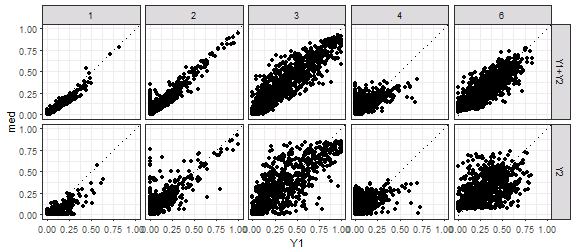
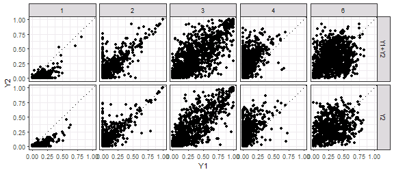
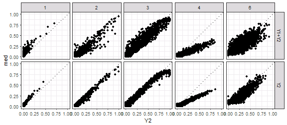
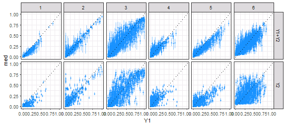
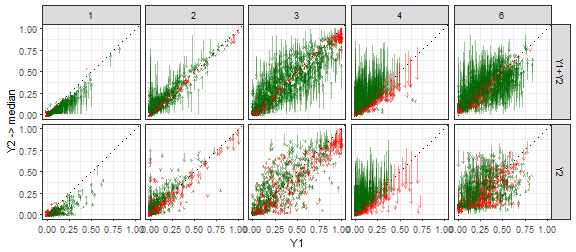
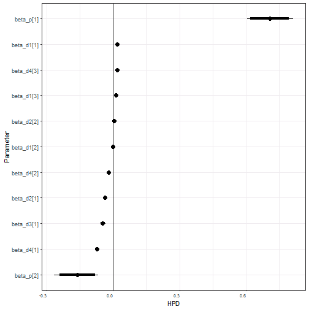
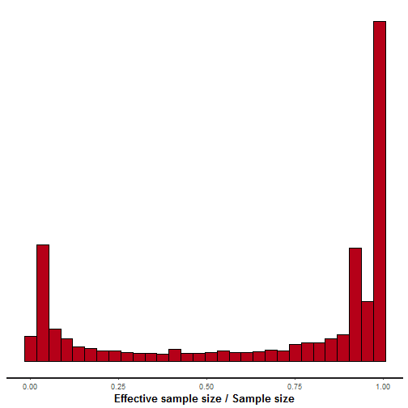
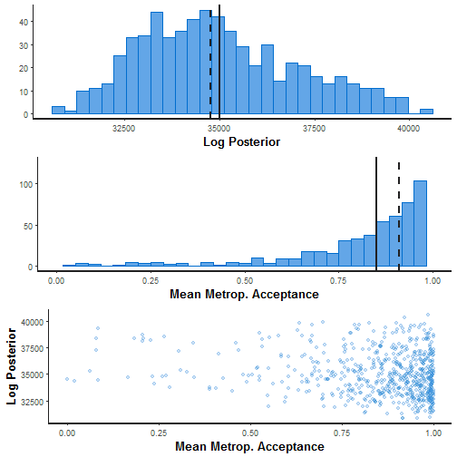
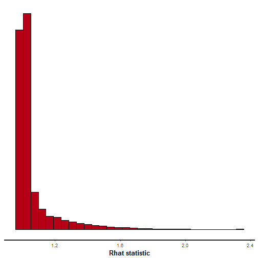
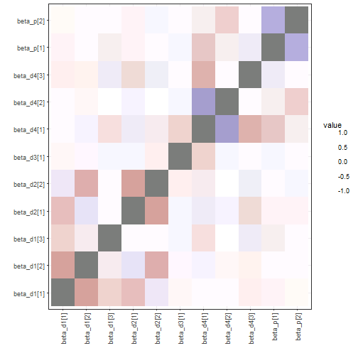

```r
grdSz <- "01_1a"
blockSize <- 10  # block = (blockSize x blockSize) grid cells

# cell-block reference tibble
cb.i <- read_csv(paste0("data/roads_", grdSz, ".csv")) %>% 
  mutate(CellRow=1:n_distinct(top) %>% rep(n_distinct(left)),
         CellCol=1:n_distinct(left) %>% rep(each=n_distinct(top))) %>%
  filter((CellRow <= max((CellRow %/% blockSize) * blockSize)) &
           (CellCol <= max((CellCol %/% blockSize) * blockSize))) %>%
  mutate(BlockRow=((CellRow-1)%/%blockSize)+1, 
         BlockCol=((CellCol-1)%/%blockSize)+1,
         BlockID=paste(BlockCol, BlockRow) %>% factor %>% as.numeric) %>%
  select(c(CellID, CellRow, CellCol, BlockID, BlockRow, BlockCol, left, top))

# covariates summarized to blocks
pop00 <- read_csv(paste0("data/pop00_", grdSz, ".csv")) %>% 
  rename(CellID=category) %>% 
  add_blocks(cb.i=cb.i) %>% summarise(popTot=sum(sum)) %>% 
  ungroup %>% mutate(popSc=scale(popTot))
rdLen <- read_csv(paste0("data/roads_", grdSz, ".csv")) %>% 
  add_blocks(cb.i=cb.i) %>% summarise(rdLen=sum(roadLen)) %>% 
  ungroup %>% mutate(lenSc=scale(rdLen))
clim <- read_csv(paste0("data/clim_", grdSz, ".csv")) %>% 
  add_blocks(cb.i=cb.i) %>%  
  summarise(b1=mean(bio1_mean), b7=mean(bio7_mean), b12=mean(bio12_mean)) %>% 
  ungroup %>% mutate(tmean=scale(b1), tseas=scale(b7), precip=scale(b12))

# land cover summarized to blocks
grnt <- read_csv(paste0("data/out_", grdSz, "_grnt.csv")) %>% 
  mutate(CellID=1:nrow(.)) %>% add_blocks(cb.i=cb.i) %>% 
  summarise(Dev=sum(V1)/n(), Oth=sum(V2)/n(), Hwd=sum(V3)/n(), 
            WP=sum(V4)/n(), Evg=sum(V5)/n(), Mxd=sum(V6)/n()) %>%
  select(-BlockID) %>% as.matrix
nlcd <- read_csv(paste0("data/out_",grdSz,"_nlcd.csv"))  %>% 
  mutate(CellID=1:nrow(.)) %>% add_blocks(cb.i=cb.i) %>% 
  summarise(Dev=sum(V1)/n(), Oth=sum(V2)/n(), Hwd=sum(V3)/n(), 
            Evg=sum(V4)/n(), Mxd=sum(V5)/n()) %>%
  select(-BlockID) %>% as.matrix
```


```r
# small scale runs: set nCell for Y1&Y2 and Y2
set.seed(222)
nFit <- 1200
nNew <- 800
n <- sampleCells(nFit, nNew, nrow(grnt))

# Y1 & Y2
Y1.fit <- grnt[n$fit,]
Y1.new <- grnt[n$new,]
Y2 <- nlcd[n$all,]

# covariates: bias (Dev, Oth, Hwd, Evg, Mxd)
Xd <- vector("list", 4)
Xd[[1]] <- cbind(rdLen$lenSc[n$all], pop00$popSc[n$all], clim$tmean[n$all])
Xd[[2]] <- cbind(rdLen$lenSc[n$all], pop00$popSc[n$all])
Xd[[3]] <- matrix(clim$tseas[n$all], ncol=1)
Xd[[4]] <- cbind(clim$tmean[n$all], clim$precip[n$all], rdLen$lenSc[n$all])
nBd <- map_int(Xd, ncol)  # nBeta for each covariate

# covariates: WP|Evg
Xp <- cbind(clim$tmean[n$all], clim$precip[n$all])
nBp <- ncol(Xp)
```


```r
d <- list(n1=nFit, n2=nFit+1, n3=n$tot, L=6, nB_d=nBd, nB_p=nBp,
          Y1=Y1.fit[,-6], Y2=Y2[,-5], 
          X_d1=Xd[[1]], X_d2=Xd[[2]], X_d3=Xd[[3]], X_d4=Xd[[4]], X_p=Xp)
out <- stan(file="code/LC_mod.stan", data=d, init=0, thin=50, 
            iter=10000, warmup=6000, chains=8, seed=4337, 
            control=list(max_treedepth=15))
```

```
## Loading required namespace: rstudioapi
```

```
## Warning: There were 8 chains where the estimated Bayesian Fraction of Missing Information was low. See
## http://mc-stan.org/misc/warnings.html#bfmi-low
```

```
## Warning: Examine the pairs() plot to diagnose sampling problems
```


```r
##########
## munging
##########

# Full posterior
gg.nu <- ggs(out, "n_eta") %>% arrange(Parameter, Chain, Iteration)
nGG <- attr(gg.nu, "nChains")*attr(gg.nu, "nIterations")
gg.nu %<>% mutate(Y1=t(rbind(Y1.fit, Y1.new)) %>% c %>% rep(each=nGG),
                  LC=1:6 %>% rep(each=nGG) %>% rep(times=n$tot),
                  Cell=1:n$tot %>% rep(each=nGG*6),
                  Set=c("Y1+Y2", "Y2") %>% rep(times=c(nFit, nNew)*nGG*6))

# Medians
gg.med <- gg.nu %>% group_by(Cell, LC, Set, Parameter) %>%
  summarise(Y1=first(Y1), med=median(value), 
            q05=quantile(value, 0.05), q25=quantile(value, 0.25),
            q75=quantile(value, 0.75), q95=quantile(value, 0.95)) %>%
  ungroup() %>% group_by(Cell)

# Combine WP + Evg to compare to Y2
gg.EvgComb <- gg.nu
gg.EvgComb$LC[gg.EvgComb$LC==5] <- 4
gg.EvgMed <- gg.EvgComb %>% group_by(Cell, LC, Set) %>%
  summarise(med=median(value), Y1=first(Y1), 
            q05=quantile(value, 0.05), q25=quantile(value, 0.25),
            q75=quantile(value, 0.75), q95=quantile(value, 0.95)) %>%
  ungroup %>% mutate(Y2=t(Y2) %>% c)


##########
## plots
##########

ggplot(gg.EvgMed, aes(x=Y1, y=med)) + xlim(0,1) + ylim(0,1) + 
  geom_point() + geom_abline(slope=1, linetype=3) + facet_grid(Set~LC) 
```



```r
ggplot(gg.EvgMed, aes(x=Y1, y=Y2)) + xlim(0,1) + ylim(0,1) + 
  geom_point() + geom_abline(slope=1, linetype=3) + facet_grid(Set~LC) 
```



```r
ggplot(gg.EvgMed, aes(x=Y2, y=med)) + xlim(0,1) + ylim(0,1) + 
  geom_point() + geom_abline(slope=1, linetype=3) + facet_grid(Set~LC) 
```



```r
ggplot(gg.med, aes(x=Y1, y=med, ymin=q25, ymax=q75)) + xlim(0,1) + ylim(0,1) + 
  geom_pointrange(alpha=0.5, colour="dodgerblue", fatten=1.5) + 
  geom_abline(slope=1, linetype=3) + facet_grid(Set~LC) 
```



```r
ggplot(gg.EvgMed, aes(x=Y1, xend=Y1, y=Y2, yend=med,
                      colour=abs(Y2-Y1)<abs(med-Y1))) + 
  geom_abline(slope=1, linetype=3) + facet_grid(Set~LC) +
  scale_colour_manual(values=c("darkgreen", "red")) + xlim(0,1) + ylim(0,1) +
  geom_segment(arrow=arrow(length=unit(0.1, "cm")), alpha=0.4) + 
  labs(x="Y1", y="Y2 -> median") + theme(legend.position="none")
```



```r
##########
## RMSE
##########

gg.med %>% ungroup %>% group_by(Set, LC) %>%
  summarise(rmse.mod=(med-Y1)^2 %>% mean %>% sqrt %>% round(3))
```

```
## # A tibble: 12 x 3
## # Groups:   Set [?]
##      Set    LC rmse.mod
##    <chr> <int>    <dbl>
##  1 Y1+Y2     1    0.027
##  2 Y1+Y2     2    0.044
##  3 Y1+Y2     3    0.112
##  4 Y1+Y2     4    0.053
##  5 Y1+Y2     5    0.066
##  6 Y1+Y2     6    0.101
##  7    Y2     1    0.065
##  8    Y2     2    0.104
##  9    Y2     3    0.171
## 10    Y2     4    0.095
## 11    Y2     5    0.116
## 12    Y2     6    0.175
```

```r
gg.EvgMed %>% ungroup %>% group_by(Set, LC) %>%
  summarise(rmse.mod=(med-Y1)^2 %>% mean %>% sqrt %>% round(3),
            rmse.Y2=(Y2-Y1)^2 %>% mean %>% sqrt %>% round(3),
            diff=rmse.mod-rmse.Y2, prop=(diff/rmse.Y2) %>% round(3))
```

```
## # A tibble: 10 x 6
## # Groups:   Set [?]
##      Set    LC rmse.mod rmse.Y2   diff   prop
##    <chr> <dbl>    <dbl>   <dbl>  <dbl>  <dbl>
##  1 Y1+Y2     1    0.027   0.073 -0.046 -0.630
##  2 Y1+Y2     2    0.044   0.103 -0.059 -0.573
##  3 Y1+Y2     3    0.112   0.189 -0.077 -0.407
##  4 Y1+Y2     4    0.092   0.200 -0.108 -0.540
##  5 Y1+Y2     6    0.101   0.214 -0.113 -0.528
##  6    Y2     1    0.065   0.075 -0.010 -0.133
##  7    Y2     2    0.104   0.111 -0.007 -0.063
##  8    Y2     3    0.171   0.181 -0.010 -0.055
##  9    Y2     4    0.107   0.202 -0.095 -0.470
## 10    Y2     6    0.175   0.211 -0.036 -0.171
```


```r
gg.b <- ggs(out, "beta")
ggs_caterpillar(gg.b) + geom_vline(xintercept=0)
```



```r
gg.b %>% group_by(Parameter) %>%
  summarise(q025=quantile(value, 0.025) %>% round(3), 
            q25=quantile(value, 0.25) %>% round(3),
            med=median(value) %>% round(3),
            q75=quantile(value, 0.75) %>% round(3), 
            q975=quantile(value, 0.975) %>% round(3))
```

```
## # A tibble: 11 x 6
##     Parameter   q025    q25    med    q75   q975
##        <fctr>  <dbl>  <dbl>  <dbl>  <dbl>  <dbl>
##  1 beta_d1[1]  0.015  0.018  0.020  0.021  0.024
##  2 beta_d1[2] -0.004 -0.001  0.000  0.001  0.004
##  3 beta_d1[3]  0.008  0.010  0.012  0.013  0.016
##  4 beta_d2[1] -0.042 -0.038 -0.036 -0.034 -0.030
##  5 beta_d2[2] -0.002  0.002  0.004  0.005  0.008
##  6 beta_d3[1] -0.057 -0.050 -0.046 -0.043 -0.035
##  7 beta_d4[1] -0.082 -0.076 -0.073 -0.071 -0.066
##  8 beta_d4[2] -0.027 -0.022 -0.019 -0.016 -0.012
##  9 beta_d4[3]  0.012  0.015  0.017  0.020  0.023
## 10  beta_p[1]  0.605  0.668  0.709  0.744  0.815
## 11  beta_p[2] -0.267 -0.197 -0.161 -0.129 -0.067
```


```r
stan_ess(out)
```

```
## `stat_bin()` using `bins = 30`. Pick better value with `binwidth`.
```



```r
stan_diag(out)
```



```r
stan_rhat(out)
```

```
## `stat_bin()` using `bins = 30`. Pick better value with `binwidth`.
```

```
## Warning: Removed 42 rows containing non-finite values (stat_bin).
```



```r
ggs_crosscorrelation(gg.b)
```



