```r
grdSz <- "01_1a"
blockSize <- 10  # block = (blockSize x blockSize) grid cells
maxGridLen <- 40  # number of blocks to include per side: nBlocks = maxGridLen^2

# cell-block reference tibble
cb.i <- read_csv(paste0("data/roads_", grdSz, ".csv")) %>% 
  mutate(CellRow=1:n_distinct(top) %>% rep(n_distinct(left)),
         CellCol=1:n_distinct(left) %>% rep(each=n_distinct(top))) %>%
  filter((CellRow <= max((CellRow %/% blockSize) * blockSize)) &
           (CellCol <= max((CellCol %/% blockSize) * blockSize))) %>%
  mutate(BlockRow=((CellRow-1)%/%blockSize)+1, 
         BlockCol=((CellCol-1)%/%blockSize)+1,
         BlockID=paste(str_pad(BlockCol, 3, "left", "0"), 
                       str_pad(BlockRow, 3, "left", "0"), sep=".") %>% 
           as.numeric %>% factor %>% as.numeric) %>%
  select(c(CellID, CellRow, CellCol, BlockID, BlockRow, BlockCol, left, top))
Block.inc <- cb.i$BlockID[cb.i$BlockCol <= maxGridLen &
                            cb.i$BlockRow <= maxGridLen] %>% unique

# covariates summarized to blocks
pop00 <- read_csv(paste0("data/pop00_", grdSz, ".csv")) %>% 
  rename(CellID=category) %>% 
  add_blocks(cb.i=cb.i) %>% summarise(popTot=log(sum(sum)+0.001)) %>%
  filter(BlockID %in% Block.inc)
hous00 <- read_csv(paste0("data/housing00_", grdSz, ".csv")) %>% 
  rename(CellID=category) %>% 
  add_blocks(cb.i=cb.i) %>% summarise(secHome=log(sum(sum)+0.001)) %>%
  filter(BlockID %in% Block.inc)
rdLen <- read_csv(paste0("data/roads_", grdSz, ".csv")) %>% 
  add_blocks(cb.i=cb.i) %>% summarise(rdLen=log(sum(roadLen)+0.001))  %>%
  filter(BlockID %in% Block.inc)
clim <- read_csv(paste0("data/clim_", grdSz, ".csv")) %>% 
  add_blocks(cb.i=cb.i) %>% 
  summarise(b1=mean(bio1_mean), b7=mean(bio7_mean), b12=mean(bio12_mean)) %>%
  filter(BlockID %in% Block.inc)
topo <- read_csv(paste0("data/topo_", grdSz, ".csv")) %>% 
  add_blocks(cb.i=cb.i) %>% 
  summarise(el=mean(el_mean), rugg=mean(rugg_mean)) %>%
  filter(BlockID %in% Block.inc)
pWP <- read_csv(paste0("data/pWP_", grdSz, ".csv")) %>% 
  rename(CellID=category) %>%
  add_blocks(cb.i=cb.i) %>% summarise(mnWP=mean(mean)/100) %>%
  filter(BlockID %in% Block.inc)

# land cover summarized to blocks
grnt <- read_csv(paste0("data/out_", grdSz, "_grnt.csv")) %>% 
  mutate(CellID=1:nrow(.)) %>% add_blocks(cb.i=cb.i) %>% 
  summarise(Dev=sum(V1)/n(), Oth=sum(V2)/n(), Hwd=sum(V3)/n(), 
            WP=sum(V4)/n(), Evg=sum(V5)/n(), Mxd=sum(V6)/n()) %>%
  filter(BlockID %in% Block.inc) %>%
  select(-BlockID) %>% as.matrix
nlcd <- read_csv(paste0("data/out_",grdSz,"_nlcd.csv"))  %>% 
  mutate(CellID=1:nrow(.)) %>% add_blocks(cb.i=cb.i) %>% 
  summarise(Dev=sum(V1)/n(), Oth=sum(V2)/n(), Hwd=sum(V3)/n(), 
            Evg=sum(V4)/n(), Mxd=sum(V5)/n()) %>%
  filter(BlockID %in% Block.inc) %>%
  select(-BlockID) %>% as.matrix
```


```r
# small scale runs: set nCell for Y1&Y2 and Y2
set.seed(22222)
nFit <- 960
nNew <- 640
n <- sampleCells(nFit, nNew, nrow(grnt), partition=TRUE)

# Y1 & Y2
Y1.fit <- grnt[n$fit,]
Y1.new <- grnt[n$new,]
Y2 <- nlcd[n$all,]

# covariates: bias (Dev, Oth, Hwd, Evg, Mxd)
Xd <- vector("list", 4)
Xd[[1]] <- cbind(scale(rdLen$rdLen[n$all]), 
                 scale(pop00$popTot[n$all]),
                 scale(topo$el[n$all]))
Xd[[2]] <- cbind(scale(rdLen$rdLen[n$all]),
                 scale(pop00$popTot[n$all]),  #theta5, beta5
                 scale(clim$b7[n$all]))  #theta6, beta6
Xd[[3]] <- cbind(scale(clim$b7[n$all]),
                 scale(pop00$popTot[n$all]),   #theta8, beta8
                 scale(topo$el[n$all]))  #theta9, beta9
Xd[[4]] <- cbind(scale(clim$b1[n$all]),
                 scale(clim$b12[n$all]),  #theta11, beta11
                 scale(pop00$popTot[n$all]))  #theta12, beta12
nBd <- map_int(Xd, ncol)  # nBeta for each covariate

# covariates: WP|Evg
Xp <- cbind(scale(pWP$mnWP[n$all]), 
            scale(clim$b1[n$all]),
            # scale(pop00$popTot[n$all]),
            scale(topo$rugg[n$all]))
nBp <- ncol(Xp)

Yd <- tibble(d1=c(scale(grnt[,1]-nlcd[,1])),
             d2=c(scale(grnt[,2]-nlcd[,2])),
             d3=c(scale(grnt[,3]-nlcd[,3])),
             d4=c(scale((grnt[,4] + grnt[,5])-nlcd[,4])),
             nuWP=c(scale((grnt[,4]+0.0001)/(grnt[,4] + grnt[,5] + 0.0001))),
             valWP=c(scale(pWP$mnWP)),
             rdLen=c(scale(rdLen$rdLen)),
             pop00=c(scale(pop00$popTot)),
             hous00=c(scale(hous00$secHome)),
             tmean=c(scale(clim$b1)),
             tseas=c(scale(clim$b7)),
             precip=c(scale(clim$b12)),
             el=c(scale(topo$el)),
             rugg=c(scale(topo$rugg)))
cor(Yd)
```

```
##                 d1         d2          d3          d4        nuWP
## d1      1.00000000 -0.4370227 -0.05651297 -0.13929401  0.30297860
## d2     -0.43702272  1.0000000 -0.06701750 -0.05180300 -0.19311115
## d3     -0.05651297 -0.0670175  1.00000000 -0.30153621  0.01838637
## d4     -0.13929401 -0.0518030 -0.30153621  1.00000000 -0.29951284
## nuWP    0.30297860 -0.1931111  0.01838637 -0.29951284  1.00000000
## valWP   0.41614548 -0.1579347 -0.16671322 -0.27917722  0.40218758
## rdLen   0.36626297 -0.2993466  0.05786872 -0.19776235  0.23420140
## pop00   0.33705472 -0.2487720 -0.09067866 -0.22826623  0.33079884
## hous00  0.26459126 -0.1210627 -0.02290079 -0.22546247  0.29338041
## tmean   0.33455829 -0.1708354 -0.08791554 -0.38338746  0.40297893
## tseas   0.37069272 -0.1989962 -0.21902192 -0.29814445  0.43981026
## precip -0.22522766  0.1318476 -0.01192532  0.28540915 -0.31402135
## el     -0.36886754  0.1732797  0.10885130  0.36380155 -0.42075808
## rugg   -0.25191072  0.0372943  0.09379710  0.05332943 -0.19194493
##             valWP       rdLen       pop00      hous00       tmean
## d1      0.4161455  0.36626297  0.33705472  0.26459126  0.33455829
## d2     -0.1579347 -0.29934660 -0.24877204 -0.12106266 -0.17083538
## d3     -0.1667132  0.05786872 -0.09067866 -0.02290079 -0.08791554
## d4     -0.2791772 -0.19776235 -0.22826623 -0.22546247 -0.38338746
## nuWP    0.4021876  0.23420140  0.33079884  0.29338041  0.40297893
## valWP   1.0000000  0.37907408  0.47065277  0.36065288  0.74633718
## rdLen   0.3790741  1.00000000  0.39847153  0.32014570  0.32520660
## pop00   0.4706528  0.39847153  1.00000000  0.65968557  0.45555209
## hous00  0.3606529  0.32014570  0.65968557  1.00000000  0.36883045
## tmean   0.7463372  0.32520660  0.45555209  0.36883045  1.00000000
## tseas   0.7231406  0.23908876  0.48302367  0.34689350  0.80821114
## precip -0.4460111 -0.24351520 -0.36945959 -0.33678728 -0.74594459
## el     -0.7915876 -0.35115389 -0.47424498 -0.36139917 -0.96749504
## rugg   -0.5358209 -0.39751996 -0.25780300 -0.22266513 -0.43706889
##             tseas      precip         el        rugg
## d1      0.3706927 -0.22522766 -0.3688675 -0.25191072
## d2     -0.1989962  0.13184765  0.1732797  0.03729430
## d3     -0.2190219 -0.01192532  0.1088513  0.09379710
## d4     -0.2981445  0.28540915  0.3638016  0.05332943
## nuWP    0.4398103 -0.31402135 -0.4207581 -0.19194493
## valWP   0.7231406 -0.44601106 -0.7915876 -0.53582088
## rdLen   0.2390888 -0.24351520 -0.3511539 -0.39751996
## pop00   0.4830237 -0.36945959 -0.4742450 -0.25780300
## hous00  0.3468935 -0.33678728 -0.3613992 -0.22266513
## tmean   0.8082111 -0.74594459 -0.9674950 -0.43706889
## tseas   1.0000000 -0.63666080 -0.8625079 -0.30947234
## precip -0.6366608  1.00000000  0.6764559  0.33409628
## el     -0.8625079  0.67645592  1.0000000  0.47707749
## rugg   -0.3094723  0.33409628  0.4770775  1.00000000
```


```r
# block distances & adjacency
b.rows <- cb.i$BlockRow[match(rdLen$BlockID[n$all], cb.i$BlockID)]
b.cols <- cb.i$BlockCol[match(rdLen$BlockID[n$all], cb.i$BlockID)]
coords <- data.frame(b.cols, b.rows)
D <- as.matrix(dist(coords))

# knots
m.cols <- 5
m.rows <- 5
m <- m.rows * m.cols
coords_star <- place_knots(m.cols, m.rows, coords)
D_star <- as.matrix(dist(coords_star))
D_site_star <- as.matrix(dist(rbind(coords, coords_star)))[1:n$tot, 
                                                           (n$tot+1):(n$tot+m)]
plot(coords, pch=20, col="gray40"); points(coords_star, pch=8, col="red")
```

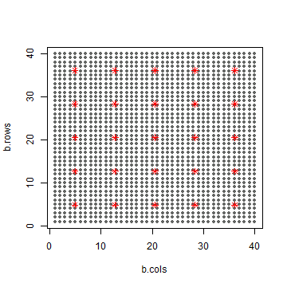


```r
d <- list(n1=nFit, n2=nFit+1, n3=n$tot, L=6, nB_d=nBd, nB_p=nBp,
          Y1=Y1.fit[,-6], Y2=Y2[,-5], 
          m=m, D_star=D_star, D_site_star=D_site_star,
          X_d1=Xd[[1]], X_d2=Xd[[2]], X_d3=Xd[[3]], X_d4=Xd[[4]], X_p=Xp)
stan_rdump(ls(d), file="code/LC_mod_examp.Rdump", envir=list2env(d))
out <- stan(file="code/LC_mod_Y2X_GPP.stan", init=0, thin=25,
            data=read_rdump("code/LC_mod_examp.Rdump"), 
            iter=10000, warmup=5000, chains=6, seed=4337, refresh=1000,
            include=FALSE, pars=c("Y2_ds", "Y2_ds_new", "sig_sq", "eta_sq",
                                  "e_z", "w_z", "w", "w_star",
                                  "Cstar", "C_site_inv_Cstar", "C_site_star"))
```

```
## Loading required namespace: rstudioapi
```

```
## Warning: There were 154 divergent transitions after warmup. Increasing adapt_delta above 0.8 may help. See
## http://mc-stan.org/misc/warnings.html#divergent-transitions-after-warmup
```

```
## Warning: There were 6 chains where the estimated Bayesian Fraction of Missing Information was low. See
## http://mc-stan.org/misc/warnings.html#bfmi-low
```

```
## Warning: Examine the pairs() plot to diagnose sampling problems
```

```r
check_treedepth(out); check_energy(out); check_div(out)
```

```
## [1] "0 of 1200 iterations saturated the maximum tree depth of 10 (0%)"
```

```
## [1] "154 of 1200 iterations ended with a divergence (12.8333333333333%)"
## [1] "Try running with larger adapt_delta to remove the divergences"
```

```r
sampler_params <- get_sampler_params(out, inc_warmup=FALSE)
n_gradients <- sapply(sampler_params, function(x) sum(x[,'n_leapfrog__']))
n_gradients; sum(n_gradients)
```

```
## [1]  96421  31113 100829  97142  47271  49278
```

```
## [1] 422054
```

```r
get_elapsed_time(out)
```

```
##           warmup   sample
## chain:1 117857.0 136649.0
## chain:2 105110.0  60790.1
## chain:3  77170.2 163024.0
## chain:4  89887.5 152149.0
## chain:5  92196.5  88232.7
## chain:6 110340.0  87538.2
```


```r
##########
## munging
##########

# Full posterior
gg.nu <- ggs(out, "n_eta") %>% arrange(Parameter, Chain, Iteration)
nGG <- attr(gg.nu, "nChains")*attr(gg.nu, "nIterations")
gg.nu %<>% mutate(Y1=t(rbind(Y1.fit, Y1.new)) %>% c %>% rep(each=nGG),
                  LC=1:6 %>% rep(each=nGG) %>% rep(times=n$tot),
                  BlockID=pop00$BlockID[n$all] %>% rep(each=nGG*6),
                  CellID=1:length(n$all) %>% rep(each=nGG*6),
                  Set=c("Y1+Y2", "Y2") %>% rep(times=c(nFit, nNew)*nGG*6)) %>%
  mutate(BlockRow=cb.i$BlockRow[match(.$BlockID, cb.i$BlockID)], 
         BlockCol=cb.i$BlockCol[match(.$BlockID, cb.i$BlockID)])

# Medians
gg.med <- gg.nu %>% 
  group_by(CellID, BlockID, BlockRow, BlockCol, LC, Set, Parameter) %>%
  summarise(Y1=first(Y1), med=median(value), 
            q05=quantile(value, 0.05), q25=quantile(value, 0.25),
            q75=quantile(value, 0.75), q95=quantile(value, 0.95)) %>%
  ungroup() %>% group_by(BlockID)

# Combine WP + Evg to compare to Y2
gg.EvgComb <- gg.nu
gg.EvgComb$LC[gg.EvgComb$LC==5] <- 4
gg.EvgMed <- gg.EvgComb %>% group_by(CellID, BlockID, LC, Set) %>%
  summarise(med=median(value), Y1=first(Y1), 
            q05=quantile(value, 0.05), q25=quantile(value, 0.25),
            q75=quantile(value, 0.75), q95=quantile(value, 0.95)) %>%
  arrange(CellID, LC) %>%
  ungroup %>% mutate(Y2=t(Y2) %>% c)


##########
## plots
##########

ggplot(gg.EvgMed, aes(x=Y1, y=med)) + xlim(0,1) + ylim(0,1) + 
  geom_point(alpha=0.5) + facet_grid(Set~LC) + 
  geom_abline(slope=1, linetype=2, colour="red")
```

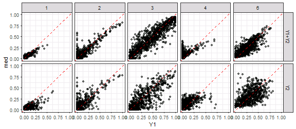

```r
ggplot(gg.EvgMed, aes(x=Y1, y=Y2)) + xlim(0,1) + ylim(0,1) + 
  geom_point(alpha=0.5) + facet_grid(Set~LC) + 
  geom_abline(slope=1, linetype=2, colour="red")
```

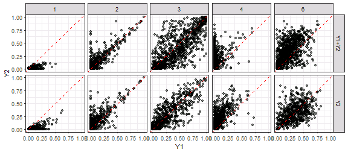

```r
ggplot(gg.EvgMed, aes(x=Y2, y=med)) + xlim(0,1) + ylim(0,1) + 
  geom_point(alpha=0.5) + facet_grid(Set~LC) + 
  geom_abline(slope=1, linetype=2, colour="red")
```

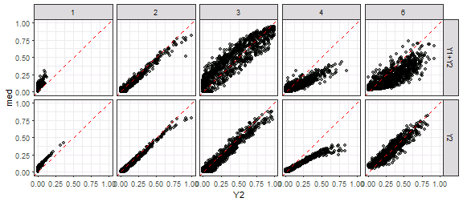

```r
ggplot(gg.med, aes(x=Y1, y=med, ymin=q25, ymax=q75)) + xlim(0,1) + ylim(0,1) + 
  geom_pointrange(alpha=0.5, colour="dodgerblue", fatten=1.5) + 
  geom_abline(slope=1, linetype=3) + facet_grid(Set~LC) 
```

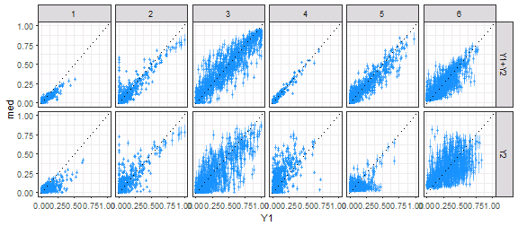

```r
ggplot(gg.EvgMed, aes(x=Y1, xend=Y1, y=Y2, yend=med,
                      colour=abs(Y2-Y1)<abs(med-Y1))) + 
  geom_abline(slope=1, linetype=3) + facet_grid(Set~LC) +
  scale_colour_manual(values=c("darkgreen", "red")) + xlim(0,1) + ylim(0,1) +
  geom_segment(arrow=arrow(length=unit(0.1, "cm")), alpha=0.4) + 
  labs(x="Y1", y="Y2 -> median") + theme(legend.position="none")
```

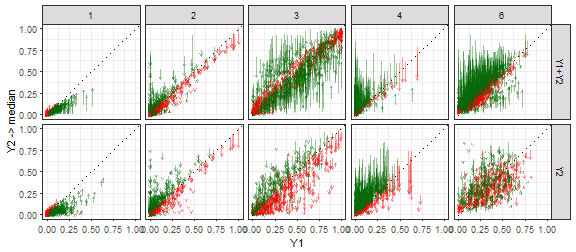

```r
##########
## RMSE
##########

gg.med %>% ungroup %>% group_by(Set, LC) %>%
  summarise(rmse.mod=(med-Y1)^2 %>% mean %>% sqrt %>% round(3))
```

```
## # A tibble: 12 x 3
## # Groups:   Set [?]
##      Set    LC rmse.mod
##    <chr> <int>    <dbl>
##  1 Y1+Y2     1    0.028
##  2 Y1+Y2     2    0.068
##  3 Y1+Y2     3    0.124
##  4 Y1+Y2     4    0.016
##  5 Y1+Y2     5    0.076
##  6 Y1+Y2     6    0.090
##  7    Y2     1    0.073
##  8    Y2     2    0.102
##  9    Y2     3    0.162
## 10    Y2     4    0.137
## 11    Y2     5    0.095
## 12    Y2     6    0.171
```

```r
gg.EvgMed %>% ungroup %>% group_by(Set, LC) %>%
  summarise(rmse.mod=(med-Y1)^2 %>% mean %>% sqrt %>% round(3),
            rmse.Y2=(Y2-Y1)^2 %>% mean %>% sqrt %>% round(3),
            diff=rmse.mod-rmse.Y2, prop=(diff/rmse.Y2) %>% round(3))
```

```
## # A tibble: 10 x 6
## # Groups:   Set [?]
##      Set    LC rmse.mod rmse.Y2   diff   prop
##    <chr> <dbl>    <dbl>   <dbl>  <dbl>  <dbl>
##  1 Y1+Y2     1    0.028   0.053 -0.025 -0.472
##  2 Y1+Y2     2    0.068   0.084 -0.016 -0.190
##  3 Y1+Y2     3    0.124   0.210 -0.086 -0.410
##  4 Y1+Y2     4    0.096   0.187 -0.091 -0.487
##  5 Y1+Y2     6    0.090   0.213 -0.123 -0.577
##  6    Y2     1    0.073   0.093 -0.020 -0.215
##  7    Y2     2    0.102   0.114 -0.012 -0.105
##  8    Y2     3    0.162   0.154  0.008  0.052
##  9    Y2     4    0.104   0.184 -0.080 -0.435
## 10    Y2     6    0.171   0.185 -0.014 -0.076
```


```r
ggplot(gg.med, aes(x=BlockCol, y=BlockRow)) + 
  geom_tile(aes(fill=med-Y1, colour=Set)) + facet_grid(.~LC) +
  scale_fill_gradient2(limits=c(-1, 1)) + 
  scale_colour_manual(values=c("NA", "gray30")) +
  geom_point(data=coords_star, aes(x=b.cols, y=b.rows), shape=1)
```

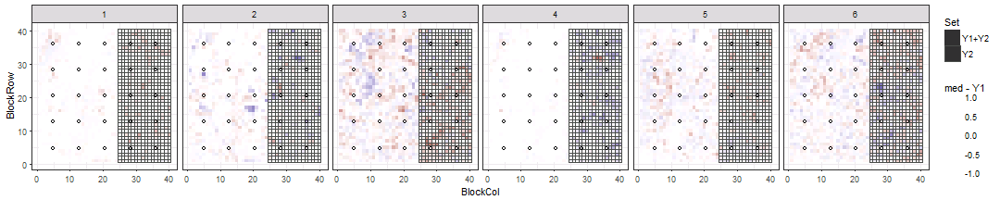


```r
gg.b <- ggs(out, "beta")
ggs_caterpillar(gg.b) + geom_vline(xintercept=0)
```


```r
traceplot(out, pars=c("beta_d", "beta_p"))
```


```r
gg.b %>% group_by(Parameter) %>%
  summarise(q025=quantile(value, 0.025) %>% round(3), 
            q25=quantile(value, 0.25) %>% round(3),
            med=median(value) %>% round(3),
            q75=quantile(value, 0.75) %>% round(3), 
            q975=quantile(value, 0.975) %>% round(3))
```

```
## # A tibble: 15 x 6
##     Parameter   q025    q25    med    q75   q975
##        <fctr>  <dbl>  <dbl>  <dbl>  <dbl>  <dbl>
##  1  beta_d[1]  0.009  0.011  0.012  0.013  0.015
##  2  beta_d[2]  0.002  0.004  0.005  0.006  0.009
##  3  beta_d[3] -0.014 -0.011 -0.009 -0.007 -0.004
##  4  beta_d[4] -0.024 -0.020 -0.018 -0.017 -0.013
##  5  beta_d[5] -0.015 -0.012 -0.010 -0.008 -0.004
##  6  beta_d[6] -0.011 -0.005 -0.002  0.002  0.009
##  7  beta_d[7] -0.191 -0.156 -0.138 -0.124 -0.089
##  8  beta_d[8] -0.021 -0.012 -0.008 -0.004  0.005
##  9  beta_d[9] -0.125 -0.097 -0.082 -0.069 -0.042
## 10 beta_d[10] -0.040 -0.026 -0.019 -0.013  0.001
## 11 beta_d[11]  0.017  0.027  0.031  0.038  0.049
## 12 beta_d[12] -0.003  0.001  0.003  0.005  0.010
## 13  beta_p[1]  0.836  1.000  1.101  1.218  1.443
## 14  beta_p[2]  2.364  2.568  2.726  2.872  3.131
## 15  beta_p[3]  0.276  0.361  0.405  0.460  0.582
```


```r
stan_ess(out)
```

```
## `stat_bin()` using `bins = 30`. Pick better value with `binwidth`.
```

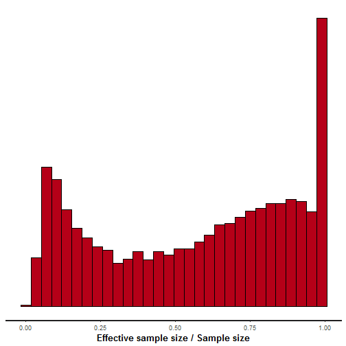

```r
stan_diag(out)
```

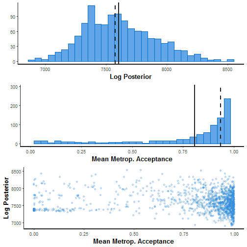

```r
stan_rhat(out)
```

```
## `stat_bin()` using `bins = 30`. Pick better value with `binwidth`.
```

```
## Warning: Removed 11 rows containing non-finite values (stat_bin).
```

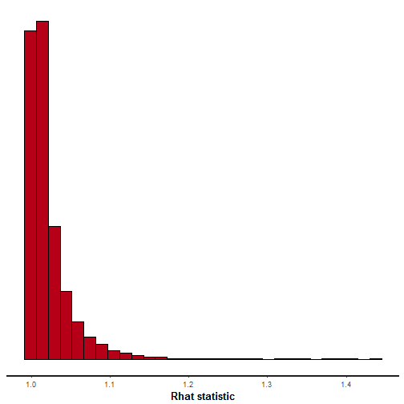

```r
ggs_crosscorrelation(gg.b)
```

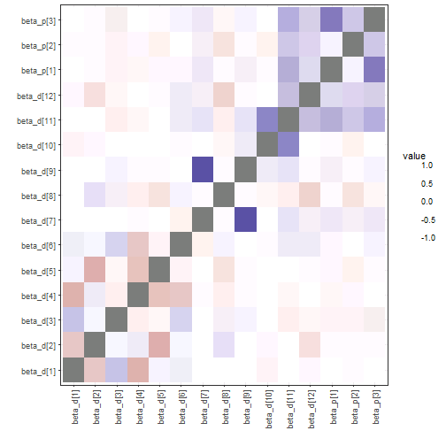

```r
ggs_crosscorrelation(ggs(out, "theta"))
```

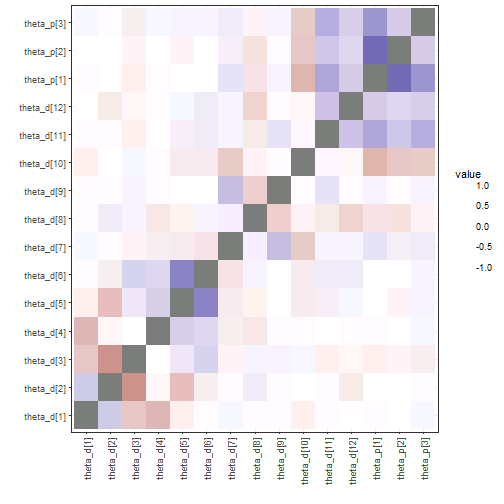

```r
sampler_params <- get_sampler_params(out, inc_warmup=FALSE) %>% do.call(rbind, .)
samp.out <- cbind(sampler_params[,c(1,6)], extract(out, pars="lp__")[[1]], 
                  extract(out, pars="L_sigma_unif")[[1]])
```

```
## Error in check_pars(allpars, pars): no parameter L_sigma_unif
```

```r
colnames(samp.out) <- c("accept_stat__", "energy__", "lp__", 
                        "L_sig1[1]", "L_sig1[2]", "L_sig1[3]", 
                        "L_sig1[4]", "L_sig1[5]")
```

```
## Error in colnames(samp.out) <- c("accept_stat__", "energy__", "lp__", : object 'samp.out' not found
```

```r
pairs(samp.out, diag.panel=panel.hist, lower.panel=panel.cor,
      upper.panel=function(...) smoothScatter(...,nrpoints=0, add=TRUE))
```

```
## Error in pairs(samp.out, diag.panel = panel.hist, lower.panel = panel.cor, : object 'samp.out' not found
```

```r
samp.out <- cbind(sampler_params[,c(1,6)], extract(out, pars="lp__")[[1]], 
                  extract(out, pars="beta_d")[[1]],
                  extract(out, pars="beta_p")[[1]])
pairs(samp.out, diag.panel=panel.hist, lower.panel=panel.cor,
      upper.panel=function(...) smoothScatter(...,nrpoints=0, add=TRUE))
```

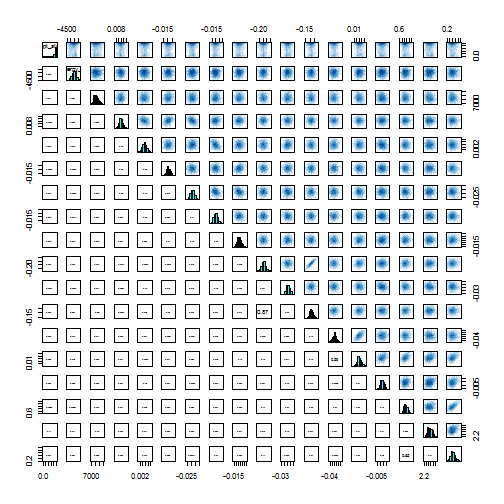

```r
# shinystan::launch_shinystan(out)
```


