```r
grdSz <- "01_1a"
blockSize <- 15  # block = (blockSize x blockSize) grid cells

# cell-block reference tibble
cb.i <- read_csv(paste0("data/roads_", grdSz, ".csv")) %>% 
  mutate(CellRow=1:n_distinct(top) %>% rep(n_distinct(left)),
         CellCol=1:n_distinct(left) %>% rep(each=n_distinct(top))) %>%
  filter((CellRow <= max((CellRow %/% blockSize) * blockSize)) &
           (CellCol <= max((CellCol %/% blockSize) * blockSize))) %>%
  mutate(BlockRow=((CellRow-1)%/%blockSize)+1, 
         BlockCol=((CellCol-1)%/%blockSize)+1,
         BlockID=paste(BlockCol, BlockRow) %>% factor %>% as.numeric) %>%
  select(c(CellID, CellRow, CellCol, BlockID, BlockRow, BlockCol, left, top))

# covariates summarized to blocks
pop00 <- read_csv(paste0("data/pop00_", grdSz, ".csv")) %>% 
  rename(CellID=category) %>% 
  add_blocks(cb.i=cb.i) %>% summarise(popTot=log(sum(sum)+0.001))
hous00 <- read_csv(paste0("data/housing00_", grdSz, ".csv")) %>% 
  rename(CellID=category) %>% 
  add_blocks(cb.i=cb.i) %>% summarise(secHome=log(sum(sum)+0.001))
rdLen <- read_csv(paste0("data/roads_", grdSz, ".csv")) %>% 
  add_blocks(cb.i=cb.i) %>% summarise(rdLen=log(sum(roadLen)+0.001)) 
clim <- read_csv(paste0("data/clim_", grdSz, ".csv")) %>% 
  add_blocks(cb.i=cb.i) %>% 
  summarise(b1=mean(bio1_mean), b7=mean(bio7_mean), b12=mean(bio12_mean))
topo <- read_csv(paste0("data/topo_", grdSz, ".csv")) %>% 
  add_blocks(cb.i=cb.i) %>% 
  summarise(el=mean(el_mean), rugg=mean(rugg_mean))
pWP <- read_csv(paste0("data/pWP_", grdSz, ".csv")) %>% 
  rename(CellID=category) %>%
  add_blocks(cb.i=cb.i) %>% summarise(mnWP=mean(mean)/100)

# land cover summarized to blocks
grnt <- read_csv(paste0("data/out_", grdSz, "_grnt.csv")) %>% 
  mutate(CellID=1:nrow(.)) %>% add_blocks(cb.i=cb.i) %>% 
  summarise(Dev=sum(V1)/n(), Oth=sum(V2)/n(), Hwd=sum(V3)/n(), 
            WP=sum(V4)/n(), Evg=sum(V5)/n(), Mxd=sum(V6)/n()) %>%
  select(-BlockID) %>% as.matrix
nlcd <- read_csv(paste0("data/out_",grdSz,"_nlcd.csv"))  %>% 
  mutate(CellID=1:nrow(.)) %>% add_blocks(cb.i=cb.i) %>% 
  summarise(Dev=sum(V1)/n(), Oth=sum(V2)/n(), Hwd=sum(V3)/n(), 
            Evg=sum(V4)/n(), Mxd=sum(V5)/n()) %>%
  select(-BlockID) %>% as.matrix
```


```r
# small scale runs: set nCell for Y1&Y2 and Y2
set.seed(2222)
nFit <- 583
nNew <- 389
n <- sampleCells(nFit, nNew, nrow(grnt))

# Y1 & Y2
Y1.fit <- grnt[n$fit,]
Y1.new <- grnt[n$new,]
Y2 <- nlcd[n$all,]

# covariates: bias (Dev, Oth, Hwd, Evg, Mxd)
Xd <- vector("list", 4)
Xd[[1]] <- cbind(scale(rdLen$rdLen[n$all]), 
                 scale(pop00$popTot[n$all]),
                 scale(topo$el[n$all]))
Xd[[2]] <- cbind(scale(rdLen$rdLen[n$all]),
                 scale(pop00$popTot[n$all]))#,  #theta5, beta5
#                  scale(clim$b7[n$all]))  #theta6, beta6
Xd[[3]] <- cbind(scale(clim$b7[n$all]),
                 scale(pop00$popTot[n$all]))#,   #theta8, beta8
                 # scale(topo$el[n$all]))  #theta9, beta9
Xd[[4]] <- cbind(scale(clim$b1[n$all]),
                 scale(clim$b12[n$all]))#,  #theta11, beta11
#                  scale(pop00$popTot[n$all]))  #theta12, beta12
nBd <- map_int(Xd, ncol)  # nBeta for each covariate

# covariates: WP|Evg
Xp <- cbind(scale(pWP$mnWP[n$all]), 
            scale(clim$b1[n$all]),
            # scale(pop00$popTot[n$all]),
            scale(topo$rugg[n$all]))
nBp <- ncol(Xp)

Yd <- tibble(d1=c(scale(grnt[,1]-nlcd[,1])),
             d2=c(scale(grnt[,2]-nlcd[,2])),
             d3=c(scale(grnt[,3]-nlcd[,3])),
             d4=c(scale((grnt[,4] + grnt[,5])-nlcd[,4])),
             nuWP=c(scale((grnt[,4]+0.0001)/(grnt[,4] + grnt[,5] + 0.0001))),
             valWP=c(scale(pWP$mnWP)),
             rdLen=c(scale(rdLen$rdLen)),
             pop00=c(scale(pop00$popTot)),
             hous00=c(scale(hous00$secHome)),
             tmean=c(scale(clim$b1)),
             tseas=c(scale(clim$b7)),
             precip=c(scale(clim$b12)),
             el=c(scale(topo$el)),
             rugg=c(scale(topo$rugg)))
cor(Yd)
```

```
##                 d1          d2           d3          d4        nuWP      valWP        rdLen      pop00
## d1      1.00000000 -0.36538171 -0.035558618 -0.16803942  0.40722274  0.4269685  0.394231401  0.4292576
## d2     -0.36538171  1.00000000 -0.053127698 -0.05109308 -0.23863567 -0.1732661 -0.286143034 -0.2652144
## d3     -0.03555862 -0.05312770  1.000000000 -0.14631565 -0.08582288 -0.2625800  0.001756099 -0.1439785
## d4     -0.16803942 -0.05109308 -0.146315648  1.00000000 -0.35860309 -0.4219330 -0.218278241 -0.3237737
## nuWP    0.40722274 -0.23863567 -0.085822884 -0.35860309  1.00000000  0.6007394  0.332722844  0.5143429
## valWP   0.42696853 -0.17326608 -0.262580040 -0.42193299  0.60073936  1.0000000  0.410678682  0.5898293
## rdLen   0.39423140 -0.28614303  0.001756099 -0.21827824  0.33272284  0.4106787  1.000000000  0.5014174
## pop00   0.42925759 -0.26521444 -0.143978487 -0.32377366  0.51434286  0.5898293  0.501417399  1.0000000
## hous00  0.30608315 -0.14790257 -0.043596720 -0.27971500  0.37038117  0.4162438  0.415709367  0.7047658
## tmean   0.35743732 -0.18209740 -0.219092702 -0.49250015  0.54696972  0.8188190  0.389216611  0.5681312
## tseas   0.35217853 -0.19323835 -0.287891836 -0.39762282  0.55170963  0.7663642  0.281031308  0.5069706
## precip -0.23330365  0.11948446 -0.036932262  0.20586456 -0.32718425 -0.3506116 -0.253982729 -0.3333442
## el     -0.38369692  0.17683875  0.237034898  0.48300539 -0.56187206 -0.8544490 -0.405391454 -0.5711340
## rugg   -0.33028352  0.05126049  0.084099322  0.05127533 -0.33644074 -0.4835995 -0.461135434 -0.3685389
##             hous00      tmean      tseas      precip         el        rugg
## d1      0.30608315  0.3574373  0.3521785 -0.23330365 -0.3836969 -0.33028352
## d2     -0.14790257 -0.1820974 -0.1932383  0.11948446  0.1768387  0.05126049
## d3     -0.04359672 -0.2190927 -0.2878918 -0.03693226  0.2370349  0.08409932
## d4     -0.27971500 -0.4925001 -0.3976228  0.20586456  0.4830054  0.05127533
## nuWP    0.37038117  0.5469697  0.5517096 -0.32718425 -0.5618721 -0.33644074
## valWP   0.41624377  0.8188190  0.7663642 -0.35061158 -0.8544490 -0.48359950
## rdLen   0.41570937  0.3892166  0.2810313 -0.25398273 -0.4053915 -0.46113543
## pop00   0.70476583  0.5681312  0.5069706 -0.33334420 -0.5711340 -0.36853888
## hous00  1.00000000  0.4186809  0.3426851 -0.26942371 -0.4093582 -0.29127914
## tmean   0.41868089  1.0000000  0.8141435 -0.55599237 -0.9779151 -0.41890629
## tseas   0.34268512  0.8141435  1.0000000 -0.51534472 -0.8710157 -0.25155968
## precip -0.26942371 -0.5559924 -0.5153447  1.00000000  0.5006350  0.36577888
## el     -0.40935820 -0.9779151 -0.8710157  0.50063505  1.0000000  0.43071205
## rugg   -0.29127914 -0.4189063 -0.2515597  0.36577888  0.4307121  1.00000000
```


```r
# block distances & adjacency
b.rows <- cb.i$BlockRow[match(rdLen$BlockID[n$all], cb.i$BlockID)]
b.cols <- cb.i$BlockCol[match(rdLen$BlockID[n$all], cb.i$BlockID)]
coords <- data.frame(b.cols, b.rows)
D <- as.matrix(dist(coords))
# W <- as.matrix(dist(coords, diag=T, upper=T)) < 1.5
# diag(W) <- 0

# knots
m.cols <- 10
m.rows <- 6
m <- m.rows * m.cols
coords_star <- place_knots(m.cols, m.rows, coords)
D_star <- as.matrix(dist(coords_star))
D_site_star <- as.matrix(dist(rbind(coords, coords_star)))[1:n$tot, 
                                                           (n$tot+1):(n$tot+m)]
plot(coords, pch=20, col="gray40"); points(coords_star, pch=8, col="red")
```

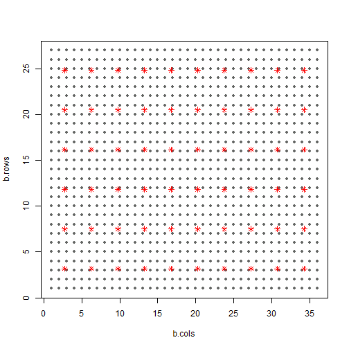


```r
d <- list(n1=nFit, n2=nFit+1, n3=n$tot, L=6, nB_d=nBd, nB_p=nBp,
          Y1=Y1.fit[,-6], Y2=Y2[,-5], #W=W, W_n=sum(W)/2,
          m=m, D_star=D_star, D_site_star=D_site_star,
          X_d1=Xd[[1]], X_d2=Xd[[2]], X_d3=Xd[[3]], X_d4=Xd[[4]], X_p=Xp)
stan_rdump(ls(d), file="code/LC_mod_examp.Rdump", envir=list2env(d))
out <- stan(file="code/LC_mod_Y2X_GPP.stan", init=0, thin=25,
            data=read_rdump("code/LC_mod_examp.Rdump"), 
            iter=4000, warmup=2000, chains=4, seed=4337, refresh=100,
            include=FALSE, pars=c("Y2_ds", "Y2_ds_new", "siq_sq", "eta_sq",
                                  "e_z", "w_z", "w", "w_star",
                                  "Cstar", "C_site_inv_Cstar", "C_site_star"))
```

```
## Loading required namespace: rstudioapi
```

```
## Warning: There were 14 divergent transitions after warmup. Increasing adapt_delta above 0.8 may help. See
## http://mc-stan.org/misc/warnings.html#divergent-transitions-after-warmup
```

```
## Warning: There were 4 chains where the estimated Bayesian Fraction of Missing Information was low. See
## http://mc-stan.org/misc/warnings.html#bfmi-low
```

```
## Warning: Examine the pairs() plot to diagnose sampling problems
```

```r
check_treedepth(out); check_energy(out); check_div(out)
```

```
## [1] "0 of 320 iterations saturated the maximum tree depth of 10 (0%)"
```

```
## [1] "14 of 320 iterations ended with a divergence (4.375%)"
## [1] "Try running with larger adapt_delta to remove the divergences"
```

```r
sampler_params <- get_sampler_params(out, inc_warmup=FALSE)
n_gradients <- sapply(sampler_params, function(x) sum(x[,'n_leapfrog__']))
n_gradients; sum(n_gradients)
```

```
## [1]  9447  9977  9879 10011
```

```
## [1] 39314
```


```r
##########
## munging
##########

# Full posterior
gg.nu <- ggs(out, "n_eta") %>% arrange(Parameter, Chain, Iteration)
nGG <- attr(gg.nu, "nChains")*attr(gg.nu, "nIterations")
gg.nu %<>% mutate(Y1=t(rbind(Y1.fit, Y1.new)) %>% c %>% rep(each=nGG),
                  LC=1:6 %>% rep(each=nGG) %>% rep(times=n$tot),
                  BlockID=n$all %>% rep(each=nGG*6),
                  CellID=1:length(n$all) %>% rep(each=nGG*6),
                  Set=c("Y1+Y2", "Y2") %>% rep(times=c(nFit, nNew)*nGG*6)) %>%
  mutate(BlockRow=cb.i$BlockRow[match(.$BlockID, cb.i$BlockID)], 
         BlockCol=cb.i$BlockCol[match(.$BlockID, cb.i$BlockID)])

# Medians
gg.med <- gg.nu %>% 
  group_by(CellID, BlockID, BlockRow, BlockCol, LC, Set, Parameter) %>%
  summarise(Y1=first(Y1), med=median(value), 
            q05=quantile(value, 0.05), q25=quantile(value, 0.25),
            q75=quantile(value, 0.75), q95=quantile(value, 0.95)) %>%
  ungroup() %>% group_by(BlockID)

# Combine WP + Evg to compare to Y2
gg.EvgComb <- gg.nu
gg.EvgComb$LC[gg.EvgComb$LC==5] <- 4
gg.EvgMed <- gg.EvgComb %>% group_by(CellID, BlockID, LC, Set) %>%
  summarise(med=median(value), Y1=first(Y1), 
            q05=quantile(value, 0.05), q25=quantile(value, 0.25),
            q75=quantile(value, 0.75), q95=quantile(value, 0.95)) %>%
  arrange(CellID, LC) %>%
  ungroup %>% mutate(Y2=t(Y2) %>% c)


##########
## plots
##########

ggplot(gg.EvgMed, aes(x=Y1, y=med)) + xlim(0,1) + ylim(0,1) + 
  geom_point(alpha=0.5) + facet_grid(Set~LC) + 
  geom_abline(slope=1, linetype=2, colour="red")
```

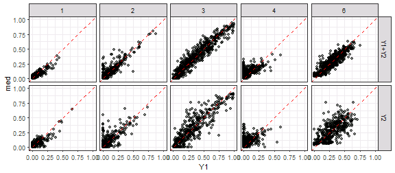

```r
ggplot(gg.EvgMed, aes(x=Y1, y=Y2)) + xlim(0,1) + ylim(0,1) + 
  geom_point(alpha=0.5) + facet_grid(Set~LC) + 
  geom_abline(slope=1, linetype=2, colour="red")
```

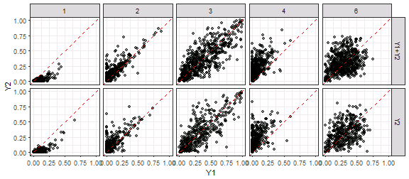

```r
ggplot(gg.EvgMed, aes(x=Y2, y=med)) + xlim(0,1) + ylim(0,1) + 
  geom_point(alpha=0.5) + facet_grid(Set~LC) + 
  geom_abline(slope=1, linetype=2, colour="red")
```

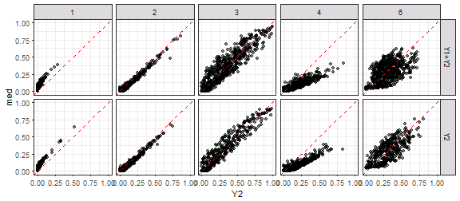

```r
ggplot(gg.med, aes(x=Y1, y=med, ymin=q25, ymax=q75)) + xlim(0,1) + ylim(0,1) + 
  geom_pointrange(alpha=0.5, colour="dodgerblue", fatten=1.5) + 
  geom_abline(slope=1, linetype=3) + facet_grid(Set~LC)
```

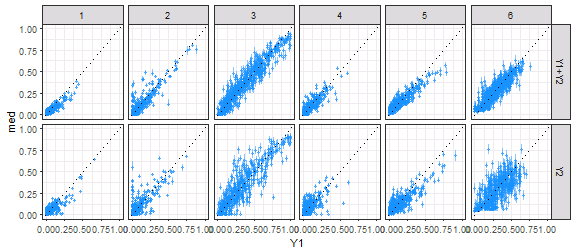

```r
ggplot(gg.EvgMed, aes(x=Y1, xend=Y1, y=Y2, yend=med,
                      colour=abs(Y2-Y1)<abs(med-Y1))) + 
  geom_abline(slope=1, linetype=3) + facet_grid(Set~LC) +
  scale_colour_manual(values=c("darkgreen", "red")) + xlim(0,1) + ylim(0,1) +
  geom_segment(arrow=arrow(length=unit(0.1, "cm")), alpha=0.4) + 
  labs(x="Y1", y="Y2 -> median") + theme(legend.position="none")
```

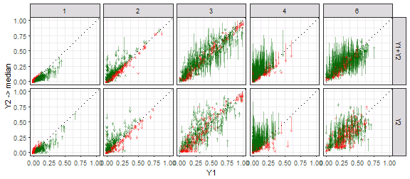

```r
ggplot(gg.med, aes(x=BlockCol, y=BlockRow)) + 
  geom_tile(aes(fill=med-Y1)) + facet_grid(Set~LC) +
  scale_fill_gradient2() + ggtitle("Y2_X") + 
  geom_point(data=coords_star, aes(x=b.cols, y=b.rows), shape=1)
```

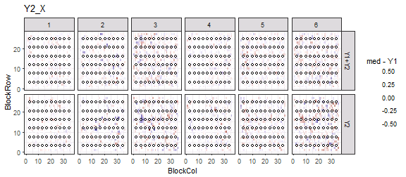

```r
##########
## RMSE
##########

gg.med %>% ungroup %>% group_by(Set, LC) %>%
  summarise(rmse.mod=(med-Y1)^2 %>% mean %>% sqrt %>% round(3))
```

```
## # A tibble: 12 x 3
## # Groups:   Set [?]
##      Set    LC rmse.mod
##    <chr> <int>    <dbl>
##  1 Y1+Y2     1    0.033
##  2 Y1+Y2     2    0.058
##  3 Y1+Y2     3    0.081
##  4 Y1+Y2     4    0.043
##  5 Y1+Y2     5    0.055
##  6 Y1+Y2     6    0.072
##  7    Y2     1    0.047
##  8    Y2     2    0.085
##  9    Y2     3    0.123
## 10    Y2     4    0.067
## 11    Y2     5    0.081
## 12    Y2     6    0.132
```

```r
gg.EvgMed %>% ungroup %>% group_by(Set, LC) %>%
  summarise(rmse.mod=(med-Y1)^2 %>% mean %>% sqrt %>% round(3),
            rmse.Y2=(Y2-Y1)^2 %>% mean %>% sqrt %>% round(3),
            diff=rmse.mod-rmse.Y2, prop=(diff/rmse.Y2) %>% round(3))
```

```
## # A tibble: 10 x 6
## # Groups:   Set [?]
##      Set    LC rmse.mod rmse.Y2   diff   prop
##    <chr> <dbl>    <dbl>   <dbl>  <dbl>  <dbl>
##  1 Y1+Y2     1    0.033   0.062 -0.029 -0.468
##  2 Y1+Y2     2    0.058   0.078 -0.020 -0.256
##  3 Y1+Y2     3    0.081   0.159 -0.078 -0.491
##  4 Y1+Y2     4    0.079   0.176 -0.097 -0.551
##  5 Y1+Y2     6    0.072   0.186 -0.114 -0.613
##  6    Y2     1    0.047   0.069 -0.022 -0.319
##  7    Y2     2    0.085   0.100 -0.015 -0.150
##  8    Y2     3    0.123   0.160 -0.037 -0.231
##  9    Y2     4    0.097   0.194 -0.097 -0.500
## 10    Y2     6    0.132   0.180 -0.048 -0.267
```


```r
gg.b <- ggs(out, "beta")
ggs_caterpillar(gg.b) + geom_vline(xintercept=0)
```

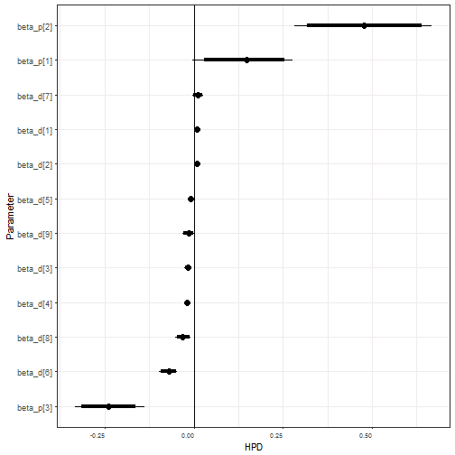

```r
traceplot(out, pars=c("beta_d", "beta_p"))
```

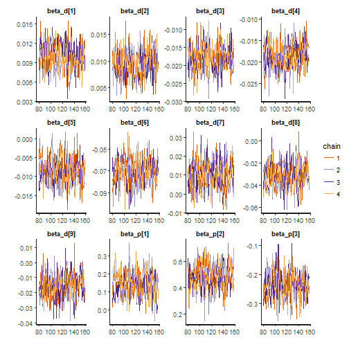

```r
gg.b %>% group_by(Parameter) %>%
  summarise(q025=quantile(value, 0.025) %>% round(3), 
            q25=quantile(value, 0.25) %>% round(3),
            med=median(value) %>% round(3),
            q75=quantile(value, 0.75) %>% round(3), 
            q975=quantile(value, 0.975) %>% round(3))
```

```
## # A tibble: 12 x 6
##    Parameter   q025    q25    med    q75   q975
##       <fctr>  <dbl>  <dbl>  <dbl>  <dbl>  <dbl>
##  1 beta_d[1]  0.006  0.008  0.010  0.011  0.014
##  2 beta_d[2]  0.004  0.008  0.009  0.011  0.015
##  3 beta_d[3] -0.026 -0.021 -0.018 -0.015 -0.010
##  4 beta_d[4] -0.025 -0.020 -0.018 -0.016 -0.013
##  5 beta_d[5] -0.016 -0.011 -0.008 -0.006 -0.002
##  6 beta_d[6] -0.097 -0.079 -0.069 -0.062 -0.047
##  7 beta_d[7] -0.004  0.005  0.011  0.016  0.026
##  8 beta_d[8] -0.052 -0.039 -0.031 -0.023 -0.010
##  9 beta_d[9] -0.032 -0.021 -0.015 -0.009  0.000
## 10 beta_p[1] -0.005  0.092  0.148  0.190  0.276
## 11 beta_p[2]  0.281  0.417  0.476  0.546  0.667
## 12 beta_p[3] -0.333 -0.270 -0.240 -0.203 -0.137
```


```r
stan_ess(out)
```

```
## `stat_bin()` using `bins = 30`. Pick better value with `binwidth`.
```

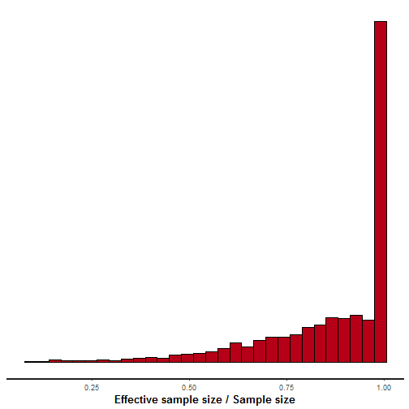

```r
stan_diag(out)
```

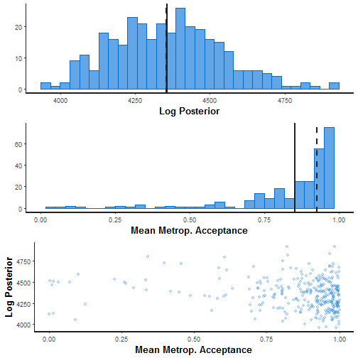

```r
stan_rhat(out)
```

```
## `stat_bin()` using `bins = 30`. Pick better value with `binwidth`.
```

```
## Warning: Removed 12 rows containing non-finite values (stat_bin).
```

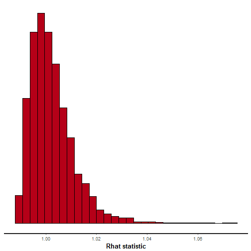

```r
ggs_crosscorrelation(gg.b)
```

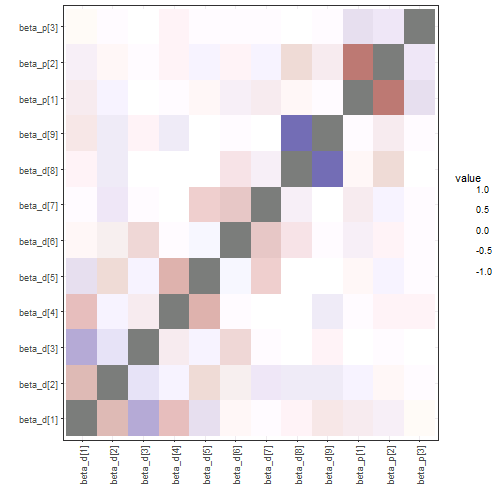

```r
ggs_crosscorrelation(ggs(out, "theta"))
```

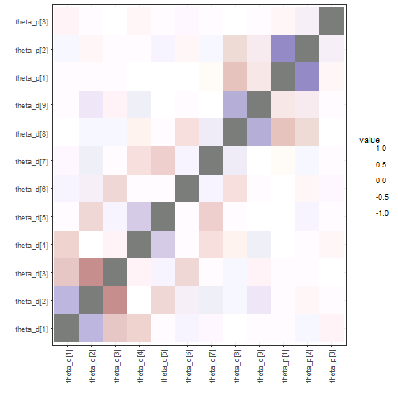

```r
sampler_params <- get_sampler_params(out, inc_warmup=FALSE) %>% do.call(rbind, .)
samp.out <- cbind(sampler_params[,c(1,6)], extract(out, pars="lp__")[[1]], 
                  extract(out, pars="L_sigma_unif")[[1]])
colnames(samp.out) <- c("accept_stat__", "energy__", "lp__", 
                        "L_sig1[1]", "L_sig1[2]", "L_sig1[3]", 
                        "L_sig1[4]", "L_sig1[5]")
pairs(samp.out, diag.panel=panel.hist, lower.panel=panel.cor,
      upper.panel=function(...) smoothScatter(...,nrpoints=0, add=TRUE))
```

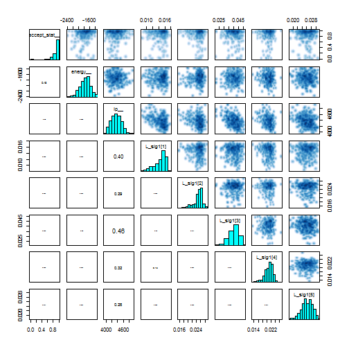

```r
samp.out <- cbind(sampler_params[,c(1,6)], extract(out, pars="lp__")[[1]], 
                  extract(out, pars="beta_d")[[1]],
                  extract(out, pars="beta_p")[[1]])
pairs(samp.out, diag.panel=panel.hist, lower.panel=panel.cor,
      upper.panel=function(...) smoothScatter(...,nrpoints=0, add=TRUE))
```

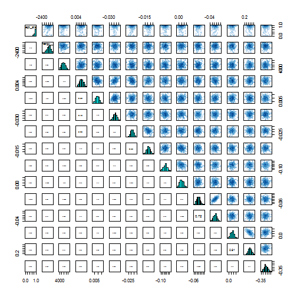

```r
shinystan::launch_shinystan(out)
```

```
## 
## Creating shinystan object...
```

```
## 
## Launching ShinyStan interface... for large models this  may take some time.
```

```
## Loading required package: shiny
```

```
## 
## Listening on http://127.0.0.1:4242
```

```
## Warning: Removed 104 rows containing missing values (geom_bar).
```


