```r
grdSz <- "01_1a"
blockSize <- 50  # block = (blockSize x blockSize) grid cells

# cell-block reference tibble
cb.i <- read_csv(paste0("data/roads_", grdSz, ".csv")) %>% 
  mutate(CellRow=1:n_distinct(top) %>% rep(n_distinct(left)),
         CellCol=1:n_distinct(left) %>% rep(each=n_distinct(top))) %>%
  filter((CellRow <= max((CellRow %/% blockSize) * blockSize)) &
           (CellCol <= max((CellCol %/% blockSize) * blockSize))) %>%
  mutate(BlockRow=((CellRow-1)%/%blockSize)+1, 
         BlockCol=((CellCol-1)%/%blockSize)+1,
         BlockID=paste(BlockCol, BlockRow) %>% factor %>% as.numeric) %>%
  select(c(CellID, CellRow, CellCol, BlockID, BlockRow, BlockCol, left, top))

# covariates summarized to blocks
pop00 <- read_csv(paste0("data/pop00_", grdSz, ".csv")) %>% 
  rename(CellID=category) %>% 
  add_blocks(cb.i=cb.i) %>% summarise(popTot=log(sum(sum)+0.001))
hous00 <- read_csv(paste0("data/housing00_", grdSz, ".csv")) %>% 
  rename(CellID=category) %>% 
  add_blocks(cb.i=cb.i) %>% summarise(secHome=log(sum(sum)+0.001))
rdLen <- read_csv(paste0("data/roads_", grdSz, ".csv")) %>% 
  add_blocks(cb.i=cb.i) %>% summarise(rdLen=log(sum(roadLen)+0.001)) 
clim <- read_csv(paste0("data/clim_", grdSz, ".csv")) %>% 
  add_blocks(cb.i=cb.i) %>% 
  summarise(b1=mean(bio1_mean), b7=mean(bio7_mean), b12=mean(bio12_mean))
topo <- read_csv(paste0("data/topo_", grdSz, ".csv")) %>% 
  add_blocks(cb.i=cb.i) %>% 
  summarise(el=mean(el_mean), rugg=mean(rugg_mean))
pWP <- read_csv(paste0("data/pWP_", grdSz, ".csv")) %>% 
  rename(CellID=category) %>%
  add_blocks(cb.i=cb.i) %>% summarise(mnWP=mean(mean)/100)

# land cover summarized to blocks
grnt <- read_csv(paste0("data/out_", grdSz, "_grnt.csv")) %>% 
  mutate(CellID=1:nrow(.)) %>% add_blocks(cb.i=cb.i) %>% 
  summarise(Dev=sum(V1)/n(), Oth=sum(V2)/n(), Hwd=sum(V3)/n(), 
            WP=sum(V4)/n(), Evg=sum(V5)/n(), Mxd=sum(V6)/n()) %>%
  select(-BlockID) %>% as.matrix
nlcd <- read_csv(paste0("data/out_",grdSz,"_nlcd.csv"))  %>% 
  mutate(CellID=1:nrow(.)) %>% add_blocks(cb.i=cb.i) %>% 
  summarise(Dev=sum(V1)/n(), Oth=sum(V2)/n(), Hwd=sum(V3)/n(), 
            Evg=sum(V4)/n(), Mxd=sum(V5)/n()) %>%
  select(-BlockID) %>% as.matrix
```


```r
# small scale runs: set nCell for Y1&Y2 and Y2
set.seed(2222)
nFit <- 50
nNew <- 30
n <- sampleCells(nFit, nNew, nrow(grnt))

# Y1 & Y2
Y1.fit <- grnt[n$fit,]
Y1.new <- grnt[n$new,]
Y2 <- nlcd[n$all,]

# covariates: bias (Dev, Oth, Hwd, Evg, Mxd)
Xd <- vector("list", 4)
Xd[[1]] <- cbind(scale(rdLen$rdLen[n$all]), 
                 scale(pop00$popTot[n$all]),
                 scale(topo$el[n$all]))
Xd[[2]] <- cbind(scale(rdLen$rdLen[n$all]), 
                 scale(pop00$popTot[n$all]),
                 scale(clim$b7[n$all]))
Xd[[3]] <- cbind(scale(clim$b7[n$all]), 
                 scale(pop00$popTot[n$all]), 
                 scale(topo$el[n$all]))
Xd[[4]] <- cbind(scale(clim$b1[n$all]), 
                 scale(clim$b12[n$all]),
                 scale(pop00$popTot[n$all]))
nBd <- map_int(Xd, ncol)  # nBeta for each covariate

# covariates: WP|Evg
Xp <- cbind(scale(pWP$mnWP[n$all]), 
            scale(clim$b1[n$all]),
            scale(pop00$popTot[n$all]),
            scale(topo$rugg[n$all]))
nBp <- ncol(Xp)

Yd <- tibble(d1=c(scale(grnt[,1]-nlcd[,1])),
             d2=c(scale(grnt[,2]-nlcd[,2])),
             d3=c(scale(grnt[,3]-nlcd[,3])),
             d4=c(scale((grnt[,4] + grnt[,5])-nlcd[,4])),
             nuWP=c(scale((grnt[,4]+0.0001)/(grnt[,4] + grnt[,5] + 0.0001))),
             valWP=c(scale(pWP$mnWP)),
             rdLen=c(scale(rdLen$rdLen)),
             pop00=c(scale(pop00$popTot)),
             hous00=c(scale(hous00$secHome)),
             tmean=c(scale(clim$b1)),
             tseas=c(scale(clim$b7)),
             precip=c(scale(clim$b12)),
             el=c(scale(topo$el)),
             rugg=c(scale(topo$rugg)))
cor(Yd)
```

```
##                d1         d2          d3          d4       nuWP      valWP
## d1      1.0000000 -0.5339573 -0.29655387 -0.29997683  0.7282611  0.6827685
## d2     -0.5339573  1.0000000  0.23109669  0.16214631 -0.5392944 -0.5193497
## d3     -0.2965539  0.2310967  1.00000000 -0.06293915 -0.3528048 -0.4259135
## d4     -0.2999768  0.1621463 -0.06293915  1.00000000 -0.5657249 -0.6176339
## nuWP    0.7282611 -0.5392944 -0.35280480 -0.56572495  1.0000000  0.8719734
## valWP   0.6827685 -0.5193497 -0.42591346 -0.61763388  0.8719734  1.0000000
## rdLen   0.5329558 -0.4395797 -0.03565905 -0.31089345  0.5150002  0.6090707
## pop00   0.7039583 -0.5029982 -0.30592079 -0.49798789  0.7267275  0.7743342
## hous00  0.6727290 -0.4305812 -0.25512587 -0.53226890  0.7328504  0.7792026
## tmean   0.5844617 -0.4193321 -0.23871758 -0.71224213  0.8185557  0.9084106
## tseas   0.5715008 -0.4513743 -0.41606207 -0.58493095  0.8027385  0.8568334
## precip -0.3480092  0.2192562 -0.05690938  0.38057512 -0.5015024 -0.4368734
## el     -0.6182015  0.4486668  0.30918450  0.69295946 -0.8560021 -0.9426274
## rugg   -0.5643330  0.2577577  0.15642948  0.14324743 -0.5072052 -0.5468024
##              rdLen      pop00     hous00      tmean      tseas      precip
## d1      0.53295584  0.7039583  0.6727290  0.5844617  0.5715008 -0.34800916
## d2     -0.43957973 -0.5029982 -0.4305812 -0.4193321 -0.4513743  0.21925620
## d3     -0.03565905 -0.3059208 -0.2551259 -0.2387176 -0.4160621 -0.05690938
## d4     -0.31089345 -0.4979879 -0.5322689 -0.7122421 -0.5849309  0.38057512
## nuWP    0.51500024  0.7267275  0.7328504  0.8185557  0.8027385 -0.50150237
## valWP   0.60907067  0.7743342  0.7792026  0.9084106  0.8568334 -0.43687338
## rdLen   1.00000000  0.6811707  0.7303120  0.6124046  0.4024083 -0.41295940
## pop00   0.68117073  1.0000000  0.9441477  0.7217905  0.6329621 -0.45875097
## hous00  0.73031199  0.9441477  1.0000000  0.7575708  0.6339859 -0.49897260
## tmean   0.61240457  0.7217905  0.7575708  1.0000000  0.8029337 -0.61124471
## tseas   0.40240832  0.6329621  0.6339859  0.8029337  1.0000000 -0.52137793
## precip -0.41295940 -0.4587510 -0.4989726 -0.6112447 -0.5213779  1.00000000
## el     -0.60054583 -0.7328494 -0.7577123 -0.9861150 -0.8735172  0.56302987
## rugg   -0.70026629 -0.6145026 -0.6349180 -0.5375769 -0.2859652  0.45314748
##                el       rugg
## d1     -0.6182015 -0.5643330
## d2      0.4486668  0.2577577
## d3      0.3091845  0.1564295
## d4      0.6929595  0.1432474
## nuWP   -0.8560021 -0.5072052
## valWP  -0.9426274 -0.5468024
## rdLen  -0.6005458 -0.7002663
## pop00  -0.7328494 -0.6145026
## hous00 -0.7577123 -0.6349180
## tmean  -0.9861150 -0.5375769
## tseas  -0.8735172 -0.2859652
## precip  0.5630299  0.4531475
## el      1.0000000  0.5073380
## rugg    0.5073380  1.0000000
```


```r
# block distances & adjacency
b.rows <- cb.i$BlockRow[match(rdLen$BlockID[n$all], cb.i$BlockID)]
b.cols <- cb.i$BlockCol[match(rdLen$BlockID[n$all], cb.i$BlockID)]
coords <- data.frame(b.rows, b.cols)
D <- as.matrix(dist(coords))
W <- as.matrix(dist(coords, diag=T, upper=T)) < 1.5
diag(W) <- 0

# knots
m.x <- 4
m.y <- 5
m <- m.x * m.y
coords_star <- place_knots(m.x, m.y, coords)
D_star <- as.matrix(dist(coords_star))
D_site_star <- as.matrix(dist(rbind(coords, coords_star)))[1:n$tot, 
                                                           (n$tot+1):(n$tot+m)]
```


```r
d <- list(n1=nFit, n2=nFit+1, n3=n$tot, L=6, nB_d=nBd, nB_p=nBp,
          Y1=Y1.fit[,-6], Y2=Y2[,-5], W=W, W_n=sum(W)/2,
          m=m, D_star=D_star, D_site_star=D_site_star,
          X_d1=Xd[[1]], X_d2=Xd[[2]], X_d3=Xd[[3]], X_d4=Xd[[4]], X_p=Xp)
stan_rdump(ls(d), file="code/LC_mod_examp.Rdump", envir=list2env(d))
out <- stan(file="code/LC_mod_Y2X_GPP.stan", init=0, thin=25,
            data=read_rdump("code/LC_mod_examp.Rdump"), 
            iter=5000, warmup=2500, chains=8, seed=4337, refresh=500,
            include=FALSE, pars=c("Y2_ds", "w_z", "e_z", "w", "sigma_e_tilde",
                                  "Cstar", "w_star", "inv_Cstar",
                                  "C_site_star", "C_ss_inv_Cstar"),
            control=list(max_treedepth=15, adapt_delta=0.9))
```

```
## hash mismatch so recompiling; make sure Stan code ends with a blank line
```

```
## In file included from C:/Users/tms1044/Documents/R/win-library/3.4/BH/include/boost/config.hpp:39:0,
##                  from C:/Users/tms1044/Documents/R/win-library/3.4/BH/include/boost/math/tools/config.hpp:13,
##                  from C:/Users/tms1044/Documents/R/win-library/3.4/StanHeaders/include/stan/math/rev/core/var.hpp:7,
##                  from C:/Users/tms1044/Documents/R/win-library/3.4/StanHeaders/include/stan/math/rev/core/gevv_vvv_vari.hpp:5,
##                  from C:/Users/tms1044/Documents/R/win-library/3.4/StanHeaders/include/stan/math/rev/core.hpp:12,
##                  from C:/Users/tms1044/Documents/R/win-library/3.4/StanHeaders/include/stan/math/rev/mat.hpp:4,
##                  from C:/Users/tms1044/Documents/R/win-library/3.4/StanHeaders/include/stan/math.hpp:4,
##                  from C:/Users/tms1044/Documents/R/win-library/3.4/StanHeaders/include/src/stan/model/model_header.hpp:4,
##                  from file6ca4cf65e93.cpp:8:
## C:/Users/tms1044/Documents/R/win-library/3.4/BH/include/boost/config/compiler/gcc.hpp:186:0: warning: "BOOST_NO_CXX11_RVALUE_REFERENCES" redefined
##  #  define BOOST_NO_CXX11_RVALUE_REFERENCES
##  ^
## <command-line>:0:0: note: this is the location of the previous definition
## cc1plus.exe: warning: unrecognized command line option "-Wno-ignored-attributes"
```

```
## Loading required namespace: rstudioapi
```

```
## Warning: There were 174 divergent transitions after warmup. Increasing adapt_delta above 0.9 may help. See
## http://mc-stan.org/misc/warnings.html#divergent-transitions-after-warmup
```

```
## Warning: There were 8 chains where the estimated Bayesian Fraction of Missing Information was low. See
## http://mc-stan.org/misc/warnings.html#bfmi-low
```

```
## Warning: Examine the pairs() plot to diagnose sampling problems
```

```r
check_treedepth(out); check_energy(out); check_div(out)
```

```
## [1] "0 of 800 iterations saturated the maximum tree depth of 10 (0%)"
```

```
## [1] "174 of 800 iterations ended with a divergence (21.75%)"
## [1] "Try running with larger adapt_delta to remove the divergences"
```

```r
sampler_params <- get_sampler_params(out, inc_warmup=FALSE)
n_gradients <- sapply(sampler_params, function(x) sum(x[,'n_leapfrog__']))
n_gradients; sum(n_gradients)
```

```
## [1] 51001 22663 12585 16721 50455  9701  8657 20482
```

```
## [1] 192265
```


```r
##########
## munging
##########

# Full posterior
gg.nu <- ggs(out, "n_eta") %>% arrange(Parameter, Chain, Iteration)
nGG <- attr(gg.nu, "nChains")*attr(gg.nu, "nIterations")
gg.nu %<>% mutate(Y1=t(rbind(Y1.fit, Y1.new)) %>% c %>% rep(each=nGG),
                  LC=1:6 %>% rep(each=nGG) %>% rep(times=n$tot),
                  BlockID=n$all %>% rep(each=nGG*6),
                  CellID=1:length(n$all) %>% rep(each=nGG*6),
                  Set=c("Y1+Y2", "Y2") %>% rep(times=c(nFit, nNew)*nGG*6)) %>%
  mutate(BlockRow=cb.i$BlockRow[match(.$BlockID, cb.i$BlockID)], 
         BlockCol=cb.i$BlockCol[match(.$BlockID, cb.i$BlockID)])

# Medians
gg.med <- gg.nu %>% 
  group_by(CellID, BlockID, BlockRow, BlockCol, LC, Set, Parameter) %>%
  summarise(Y1=first(Y1), med=median(value), 
            q05=quantile(value, 0.05), q25=quantile(value, 0.25),
            q75=quantile(value, 0.75), q95=quantile(value, 0.95)) %>%
  ungroup() %>% group_by(BlockID)

# Combine WP + Evg to compare to Y2
gg.EvgComb <- gg.nu
gg.EvgComb$LC[gg.EvgComb$LC==5] <- 4
gg.EvgMed <- gg.EvgComb %>% group_by(CellID, BlockID, LC, Set) %>%
  summarise(med=median(value), Y1=first(Y1), 
            q05=quantile(value, 0.05), q25=quantile(value, 0.25),
            q75=quantile(value, 0.75), q95=quantile(value, 0.95)) %>%
  arrange(CellID, LC) %>%
  ungroup %>% mutate(Y2=t(Y2) %>% c)


##########
## plots
##########

ggplot(gg.EvgMed, aes(x=Y1, y=med)) + xlim(0,1) + ylim(0,1) + 
  geom_point(alpha=0.5) + facet_grid(Set~LC) + 
  geom_abline(slope=1, linetype=2, colour="red") + ggtitle("Y2_X")
```

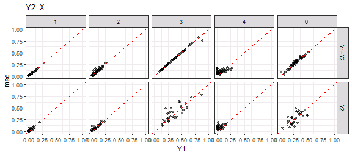

```r
ggplot(gg.EvgMed, aes(x=Y1, y=Y2)) + xlim(0,1) + ylim(0,1) + 
  geom_point(alpha=0.5) + facet_grid(Set~LC) + 
  geom_abline(slope=1, linetype=2, colour="red") + ggtitle("Y2_X") 
```

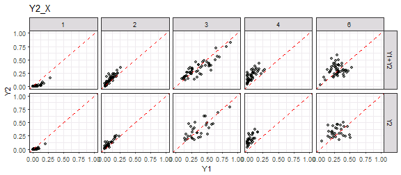

```r
ggplot(gg.EvgMed, aes(x=Y2, y=med)) + xlim(0,1) + ylim(0,1) + 
  geom_point(alpha=0.5) + facet_grid(Set~LC) + 
  geom_abline(slope=1, linetype=2, colour="red")  + ggtitle("Y2_X")
```

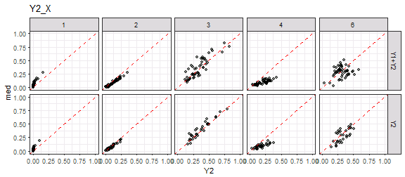

```r
ggplot(gg.med, aes(x=Y1, y=med, ymin=q25, ymax=q75)) + xlim(0,1) + ylim(0,1) + 
  geom_pointrange(alpha=0.5, colour="dodgerblue", fatten=1.5) + 
  geom_abline(slope=1, linetype=3) + facet_grid(Set~LC)  + ggtitle("Y2_X")
```

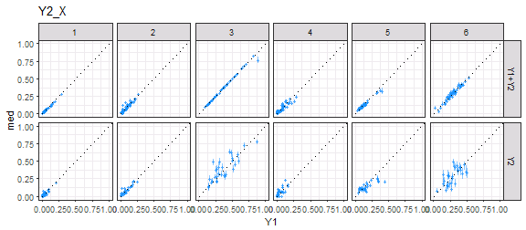

```r
ggplot(gg.EvgMed, aes(x=Y1, xend=Y1, y=Y2, yend=med,
                      colour=abs(Y2-Y1)<abs(med-Y1))) + 
  geom_abline(slope=1, linetype=3) + facet_grid(Set~LC) +
  scale_colour_manual(values=c("darkgreen", "red")) + xlim(0,1) + ylim(0,1) +
  geom_segment(arrow=arrow(length=unit(0.1, "cm")), alpha=0.4) + 
  labs(x="Y1", y="Y2 -> median") + theme(legend.position="none") +
  ggtitle("Y2_X")
```

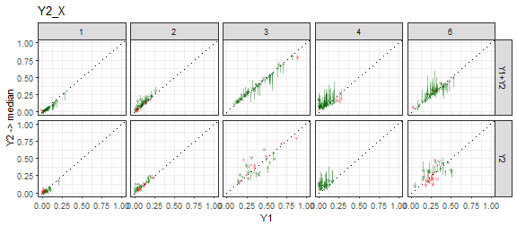

```r
ggplot(gg.med, aes(x=BlockCol, y=BlockRow, fill=med-Y1)) + 
  geom_tile() + facet_grid(Set~LC) +
  scale_fill_gradient2() + ggtitle("Y2_X")
```

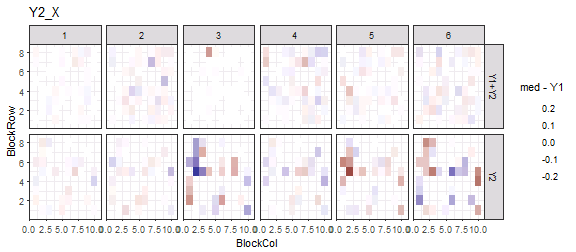

```r
##########
## RMSE
##########

gg.med %>% ungroup %>% group_by(Set, LC) %>%
  summarise(rmse.mod=(med-Y1)^2 %>% mean %>% sqrt %>% round(3))
```

```
## # A tibble: 12 x 3
## # Groups:   Set [?]
##      Set    LC rmse.mod
##    <chr> <int>    <dbl>
##  1 Y1+Y2     1    0.009
##  2 Y1+Y2     2    0.025
##  3 Y1+Y2     3    0.018
##  4 Y1+Y2     4    0.030
##  5 Y1+Y2     5    0.020
##  6 Y1+Y2     6    0.024
##  7    Y2     1    0.021
##  8    Y2     2    0.028
##  9    Y2     3    0.099
## 10    Y2     4    0.040
## 11    Y2     5    0.070
## 12    Y2     6    0.091
```

```r
gg.EvgMed %>% ungroup %>% group_by(Set, LC) %>%
  summarise(rmse.mod=(med-Y1)^2 %>% mean %>% sqrt %>% round(3),
            rmse.Y2=(Y2-Y1)^2 %>% mean %>% sqrt %>% round(3),
            diff=rmse.mod-rmse.Y2, prop=(diff/rmse.Y2) %>% round(3))
```

```
## # A tibble: 10 x 6
## # Groups:   Set [?]
##      Set    LC rmse.mod rmse.Y2   diff   prop
##    <chr> <dbl>    <dbl>   <dbl>  <dbl>  <dbl>
##  1 Y1+Y2     1    0.009   0.053 -0.044 -0.830
##  2 Y1+Y2     2    0.025   0.054 -0.029 -0.537
##  3 Y1+Y2     3    0.018   0.097 -0.079 -0.814
##  4 Y1+Y2     4    0.064   0.147 -0.083 -0.565
##  5 Y1+Y2     6    0.024   0.128 -0.104 -0.812
##  6    Y2     1    0.021   0.042 -0.021 -0.500
##  7    Y2     2    0.028   0.042 -0.014 -0.333
##  8    Y2     3    0.099   0.120 -0.021 -0.175
##  9    Y2     4    0.068   0.150 -0.082 -0.547
## 10    Y2     6    0.091   0.135 -0.044 -0.326
```


```r
gg.b <- ggs(out, "beta")
ggs_caterpillar(gg.b) + geom_vline(xintercept=0)
```

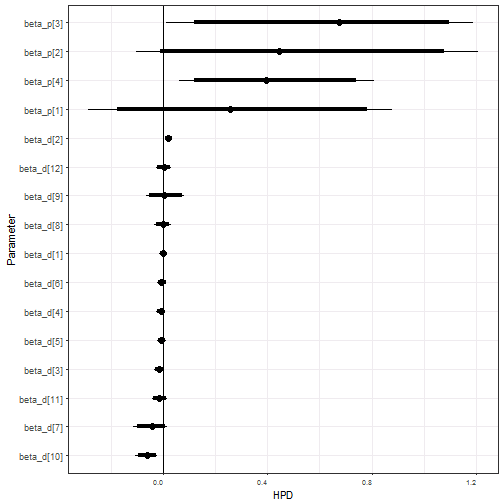

```r
traceplot(out, pars=c("beta_d", "beta_p"))
```

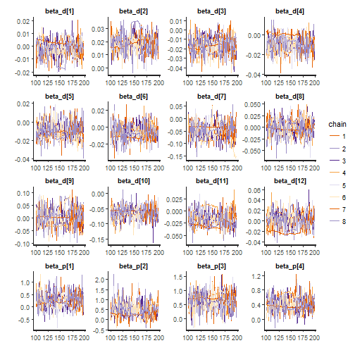

```r
gg.b %>% group_by(Parameter) %>%
  summarise(q025=quantile(value, 0.025) %>% round(3), 
            q25=quantile(value, 0.25) %>% round(3),
            med=median(value) %>% round(3),
            q75=quantile(value, 0.75) %>% round(3), 
            q975=quantile(value, 0.975) %>% round(3))
```

```
## # A tibble: 16 x 6
##     Parameter   q025    q25    med    q75   q975
##        <fctr>  <dbl>  <dbl>  <dbl>  <dbl>  <dbl>
##  1  beta_d[1] -0.017 -0.006 -0.002  0.002  0.010
##  2  beta_d[2]  0.006  0.015  0.019  0.023  0.035
##  3  beta_d[3] -0.035 -0.022 -0.016 -0.009  0.000
##  4  beta_d[4] -0.027 -0.015 -0.008 -0.002  0.006
##  5  beta_d[5] -0.024 -0.015 -0.011 -0.004  0.011
##  6  beta_d[6] -0.023 -0.012 -0.007  0.000  0.012
##  7  beta_d[7] -0.117 -0.070 -0.045 -0.028  0.014
##  8  beta_d[8] -0.035 -0.011 -0.001  0.011  0.029
##  9  beta_d[9] -0.065 -0.022  0.003  0.025  0.079
## 10 beta_d[10] -0.107 -0.077 -0.063 -0.052 -0.025
## 11 beta_d[11] -0.042 -0.028 -0.017 -0.006  0.015
## 12 beta_d[12] -0.026 -0.010  0.003  0.013  0.031
## 13  beta_p[1] -0.290  0.113  0.256  0.445  0.878
## 14  beta_p[2] -0.103  0.251  0.444  0.683  1.211
## 15  beta_p[3]  0.011  0.446  0.675  0.813  1.191
## 16  beta_p[4]  0.060  0.298  0.395  0.565  0.808
```


```r
stan_ess(out)
```

```
## `stat_bin()` using `bins = 30`. Pick better value with `binwidth`.
```

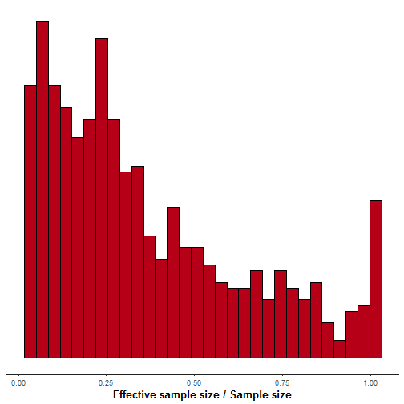

```r
stan_diag(out)
```

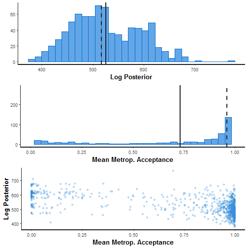

```r
stan_rhat(out)
```

```
## `stat_bin()` using `bins = 30`. Pick better value with `binwidth`.
```

```
## Warning: Removed 11 rows containing non-finite values (stat_bin).
```

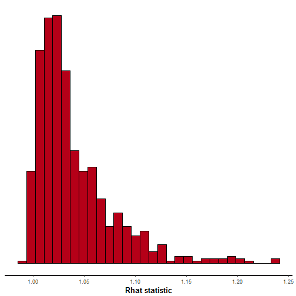

```r
ggs_crosscorrelation(gg.b)
```

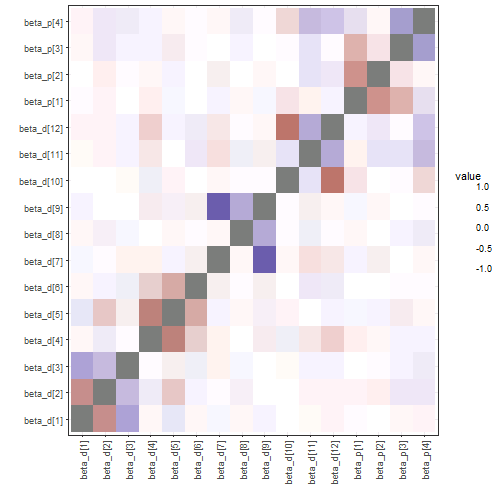

```r
ggs_crosscorrelation(ggs(out, "theta"))
```

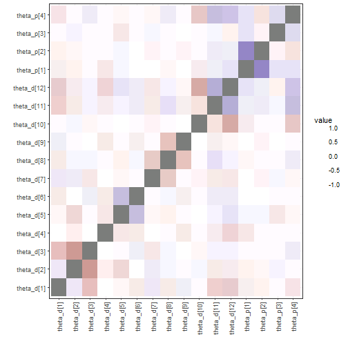

```r
sampler_params <- get_sampler_params(out, inc_warmup=FALSE) %>% do.call(rbind, .)
samp.out <- cbind(sampler_params[,c(1,6)], extract(out, pars="lp__")[[1]], 
                  extract(out, pars="L_sigma_unif")[[1]])
colnames(samp.out) <- c("accept_stat__", "energy__", "lp__", 
                        "L_sig1[1]", "L_sig1[2]", "L_sig1[3]", 
                        "L_sig1[4]", "L_sig1[5]")
pairs(samp.out, diag.panel=panel.hist, lower.panel=panel.cor,
      upper.panel=function(...) smoothScatter(...,nrpoints=0, add=TRUE))
```

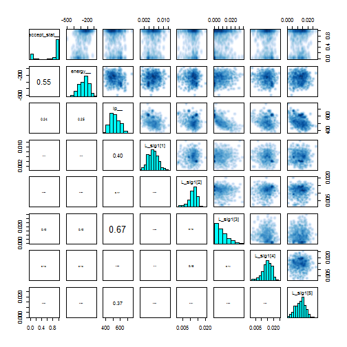

```r
samp.out <- cbind(sampler_params[,c(1,6)], extract(out, pars="lp__")[[1]], 
                  extract(out, pars="beta_d")[[1]],
                  extract(out, pars="beta_p")[[1]])
pairs(samp.out, diag.panel=panel.hist, lower.panel=panel.cor,
      upper.panel=function(...) smoothScatter(...,nrpoints=0, add=TRUE))
```

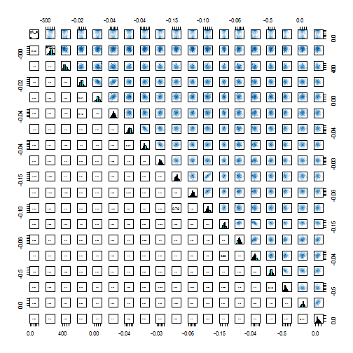

```r
shinystan::launch_shinystan(out)
```

```
## 
## Creating shinystan object...
```

```
## 
## Launching ShinyStan interface... for large models this  may take some time.
```

```
## Loading required package: shiny
```

```
## 
## Listening on http://127.0.0.1:6415
```


