```r
grdSz <- "01_1a"
blockSize <- 10  # block = (blockSize x blockSize) grid cells
maxGridLen <- 15  # number of blocks to include per side: nBlocks = maxGridLen^2

# cell-block reference tibble
cb.i <- read_csv(paste0("data/roads_", grdSz, ".csv")) %>% 
  mutate(CellRow=1:n_distinct(top) %>% rep(n_distinct(left)),
         CellCol=1:n_distinct(left) %>% rep(each=n_distinct(top))) %>%
  filter((CellRow <= max((CellRow %/% blockSize) * blockSize)) &
           (CellCol <= max((CellCol %/% blockSize) * blockSize))) %>%
  mutate(BlockRow=((CellRow-1)%/%blockSize)+1, 
         BlockCol=((CellCol-1)%/%blockSize)+1,
         BlockID=paste(str_pad(BlockCol, 7, "left", "0"), 
                       str_pad(BlockRow, 7, "left", "0"), sep=".") %>% 
           as.numeric %>% factor %>% as.numeric) %>%
  select(c(CellID, CellRow, CellCol, BlockID, BlockRow, BlockCol, left, top))
Block.inc <- cb.i$BlockID[cb.i$BlockCol <= maxGridLen &
                            cb.i$BlockRow <= maxGridLen] %>% unique

# covariates summarized to blocks
pop00 <- read_csv(paste0("data/pop00_", grdSz, ".csv")) %>% 
  rename(CellID=category) %>% 
  add_blocks(cb.i=cb.i) %>% summarise(popTot=log(sum(sum)+0.001)) %>%
  filter(BlockID %in% Block.inc)
hous00 <- read_csv(paste0("data/housing00_", grdSz, ".csv")) %>% 
  rename(CellID=category) %>% 
  add_blocks(cb.i=cb.i) %>% summarise(secHome=log(sum(sum)+0.001)) %>%
  filter(BlockID %in% Block.inc)
rdLen <- read_csv(paste0("data/roads_", grdSz, ".csv")) %>% 
  add_blocks(cb.i=cb.i) %>% summarise(rdLen=log(sum(roadLen)+0.001))  %>%
  filter(BlockID %in% Block.inc)
clim <- read_csv(paste0("data/clim_", grdSz, ".csv")) %>% 
  add_blocks(cb.i=cb.i) %>% 
  summarise(b1=mean(bio1_mean), b7=mean(bio7_mean), b12=mean(bio12_mean)) %>%
  filter(BlockID %in% Block.inc)
topo <- read_csv(paste0("data/topo_", grdSz, ".csv")) %>% 
  add_blocks(cb.i=cb.i) %>% 
  summarise(el=mean(el_mean), rugg=mean(rugg_mean)) %>%
  filter(BlockID %in% Block.inc)
pWP <- read_csv(paste0("data/pWP_", grdSz, ".csv")) %>% 
  rename(CellID=category) %>%
  add_blocks(cb.i=cb.i) %>% summarise(mnWP=mean(mean)/100) %>%
  filter(BlockID %in% Block.inc)

# land cover summarized to blocks
grnt <- read_csv(paste0("data/out_", grdSz, "_grnt.csv")) %>% 
  mutate(CellID=1:nrow(.)) %>% add_blocks(cb.i=cb.i) %>% 
  summarise(Dev=sum(V1)/n(), Oth=sum(V2)/n(), Hwd=sum(V3)/n(), 
            WP=sum(V4)/n(), Evg=sum(V5)/n(), Mxd=sum(V6)/n()) %>%
  filter(BlockID %in% Block.inc) %>%
  select(-BlockID) %>% as.matrix
nlcd <- read_csv(paste0("data/out_",grdSz,"_nlcd.csv"))  %>% 
  mutate(CellID=1:nrow(.)) %>% add_blocks(cb.i=cb.i) %>% 
  summarise(Dev=sum(V1)/n(), Oth=sum(V2)/n(), Hwd=sum(V3)/n(), 
            Evg=sum(V4)/n(), Mxd=sum(V5)/n()) %>%
  filter(BlockID %in% Block.inc) %>%
  select(-BlockID) %>% as.matrix
```


```r
# small scale runs: set nCell for Y1&Y2 and Y2
set.seed(22222)
nFit <- 135
nNew <- 90
n <- sampleCells(nFit, nNew, nrow(grnt), partition=TRUE)

# Y1 & Y2
Y1.fit <- grnt[n$fit,]
Y1.new <- grnt[n$new,]
Y2 <- nlcd[n$all,]

# covariates: bias (Dev, Oth, Hwd, Evg, Mxd)
Xd <- vector("list", 4)
Xd[[1]] <- cbind(scale(rdLen$rdLen[n$all]), 
                 scale(pop00$popTot[n$all]),
                 scale(topo$el[n$all]))
Xd[[2]] <- cbind(scale(rdLen$rdLen[n$all]),
                 scale(pop00$popTot[n$all]),  #theta5, beta5
                 scale(clim$b7[n$all]))  #theta6, beta6
Xd[[3]] <- cbind(scale(clim$b7[n$all]),
                 scale(pop00$popTot[n$all]),   #theta8, beta8
                 scale(topo$el[n$all]))  #theta9, beta9
Xd[[4]] <- cbind(scale(clim$b1[n$all]),
                 scale(clim$b12[n$all]),  #theta11, beta11
                 scale(pop00$popTot[n$all]))  #theta12, beta12
nBd <- map_int(Xd, ncol)  # nBeta for each covariate

# covariates: WP|Evg
Xp <- cbind(scale(pWP$mnWP[n$all]), 
            scale(clim$b1[n$all]),
            # scale(pop00$popTot[n$all]),
            scale(topo$rugg[n$all]))
nBp <- ncol(Xp)

Yd <- tibble(d1=c(scale(grnt[,1]-nlcd[,1])),
             d2=c(scale(grnt[,2]-nlcd[,2])),
             d3=c(scale(grnt[,3]-nlcd[,3])),
             d4=c(scale((grnt[,4] + grnt[,5])-nlcd[,4])),
             nuWP=c(scale((grnt[,4]+0.0001)/(grnt[,4] + grnt[,5] + 0.0001))),
             valWP=c(scale(pWP$mnWP)),
             rdLen=c(scale(rdLen$rdLen)),
             pop00=c(scale(pop00$popTot)),
             hous00=c(scale(hous00$secHome)),
             tmean=c(scale(clim$b1)),
             tseas=c(scale(clim$b7)),
             precip=c(scale(clim$b12)),
             el=c(scale(topo$el)),
             rugg=c(scale(topo$rugg)))
cor(Yd)
```

```
##                 d1           d2           d3          d4        nuWP
## d1      1.00000000 -0.136599276  0.028290154 -0.19519815  0.09048773
## d2     -0.13659928  1.000000000 -0.231249230  0.01099998 -0.10769524
## d3      0.02829015 -0.231249230  1.000000000 -0.20620902 -0.04378375
## d4     -0.19519815  0.010999978 -0.206209018  1.00000000 -0.34687825
## nuWP    0.09048773 -0.107695237 -0.043783749 -0.34687825  1.00000000
## valWP   0.18921286  0.165984077 -0.028517055 -0.42384625  0.16017394
## rdLen   0.31984121 -0.236906052  0.104253029 -0.26481480  0.14922943
## pop00   0.22192332 -0.114559164 -0.141245209 -0.31583803  0.30716065
## hous00  0.20494637 -0.139708823 -0.079954096 -0.39666935  0.34523625
## tmean   0.15532578  0.008710557 -0.102143039 -0.55071025  0.44968186
## tseas   0.10893598  0.054694193 -0.098445421 -0.47309704  0.42579499
## precip -0.12574645  0.105453950  0.207392301  0.43371883 -0.51218616
## el     -0.16421999 -0.071250522  0.002270254  0.52054020 -0.38896975
## rugg   -0.07913627 -0.226879281  0.049324818  0.30532655 -0.14830612
##              valWP      rdLen      pop00     hous00        tmean
## d1      0.18921286  0.3198412  0.2219233  0.2049464  0.155325776
## d2      0.16598408 -0.2369061 -0.1145592 -0.1397088  0.008710557
## d3     -0.02851705  0.1042530 -0.1412452 -0.0799541 -0.102143039
## d4     -0.42384625 -0.2648148 -0.3158380 -0.3966694 -0.550710249
## nuWP    0.16017394  0.1492294  0.3071607  0.3452362  0.449681856
## valWP   1.00000000  0.4096249  0.3548329  0.2339448  0.664864516
## rdLen   0.40962491  1.0000000  0.3068697  0.3550667  0.324677967
## pop00   0.35483293  0.3068697  1.0000000  0.7872219  0.516435550
## hous00  0.23394483  0.3550667  0.7872219  1.0000000  0.468029983
## tmean   0.66486452  0.3246780  0.5164356  0.4680300  1.000000000
## tseas   0.58269492  0.2669883  0.4708944  0.3441969  0.885818862
## precip -0.42433675 -0.2789350 -0.6332976 -0.5419957 -0.834217430
## el     -0.73026218 -0.3257329 -0.4361505 -0.3528832 -0.941116940
## rugg   -0.70841809 -0.2887430 -0.3028760 -0.1015816 -0.533722714
##              tseas     precip           el        rugg
## d1      0.10893598 -0.1257464 -0.164219990 -0.07913627
## d2      0.05469419  0.1054539 -0.071250522 -0.22687928
## d3     -0.09844542  0.2073923  0.002270254  0.04932482
## d4     -0.47309704  0.4337188  0.520540203  0.30532655
## nuWP    0.42579499 -0.5121862 -0.388969754 -0.14830612
## valWP   0.58269492 -0.4243367 -0.730262178 -0.70841809
## rdLen   0.26698825 -0.2789350 -0.325732856 -0.28874300
## pop00   0.47089443 -0.6332976 -0.436150463 -0.30287601
## hous00  0.34419693 -0.5419957 -0.352883203 -0.10158156
## tmean   0.88581886 -0.8342174 -0.941116940 -0.53372271
## tseas   1.00000000 -0.7986335 -0.893941941 -0.59245714
## precip -0.79863347  1.0000000  0.705944917  0.41114191
## el     -0.89394194  0.7059449  1.000000000  0.62947276
## rugg   -0.59245714  0.4111419  0.629472757  1.00000000
```


```r
# block distances & adjacency
b.rows <- cb.i$BlockRow[match(rdLen$BlockID[n$all], cb.i$BlockID)]
b.cols <- cb.i$BlockCol[match(rdLen$BlockID[n$all], cb.i$BlockID)]
coords <- data.frame(b.cols, b.rows)
#D <- as.matrix(dist(coords))

# knots
m.cols <- 5
m.rows <- 5
m <- m.rows * m.cols
coords_star <- place_knots(m.cols, m.rows, coords)
D_star <- as.matrix(dist(coords_star))
D_site_star <- as.matrix(dist(rbind(coords, coords_star)))[1:n$tot, 
                                                           (n$tot+1):(n$tot+m)]
plot(coords, pch=20, col="gray40"); points(coords_star, pch=8, col="red")
```

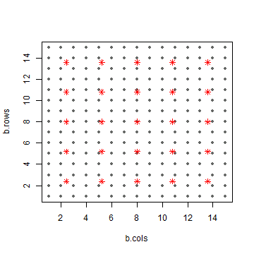


```r
M <- 9
coords.m <- as.matrix(coords[order(coords[,1]),])
ind_distM <- get_index_dist(coords.m, M)
neardistM <- sapply(1:(n$tot-1), get_neardistM, ind_distM$d)
neardist <- sapply(1:(n$tot-1), get_neardist, ind_distM$d)
nearind <- sapply(1:(n$tot-1), get_nearind, ind_distM$i)
```


```r
d <- list(n1=nFit, n2=nFit+1, n3=n$tot, L=6, nB_d=nBd, nB_p=nBp,
          Y1=Y1.fit[,-6], Y2=Y2[,-5], 
          m=m, D_star=D_star, D_site_star=D_site_star,
          M=M, nearind=t(nearind), neardist=t(neardist), neardistM=t(neardistM), 
          X_d1=Xd[[1]], X_d2=Xd[[2]], X_d3=Xd[[3]], X_d4=Xd[[4]], X_p=Xp)
stan_rdump(ls(d), file="code/LC_mod_examp.Rdump", envir=list2env(d))
out <- stan(file="code/LC_mod_Y2X_NNGP.stan", init=0, thin=25,
            data=read_rdump("code/LC_mod_examp.Rdump"), 
            iter=5000, warmup=2000, chains=4, seed=4337, refresh=200,
            include=FALSE, pars=c("Y2_", "Y2new_", "sig_sq", "eta_sq",
                                  "e_z", "w_z", "w", "w_star",
                                  "Cstar", "C_site_inv_Cstar", "C_site_star"))
```

```
## hash mismatch so recompiling; make sure Stan code ends with a blank line
```

```
## In file included from C:/Users/tms1044/Documents/R/win-library/3.4/BH/include/boost/config.hpp:39:0,
##                  from C:/Users/tms1044/Documents/R/win-library/3.4/BH/include/boost/math/tools/config.hpp:13,
##                  from C:/Users/tms1044/Documents/R/win-library/3.4/StanHeaders/include/stan/math/rev/core/var.hpp:7,
##                  from C:/Users/tms1044/Documents/R/win-library/3.4/StanHeaders/include/stan/math/rev/core/gevv_vvv_vari.hpp:5,
##                  from C:/Users/tms1044/Documents/R/win-library/3.4/StanHeaders/include/stan/math/rev/core.hpp:12,
##                  from C:/Users/tms1044/Documents/R/win-library/3.4/StanHeaders/include/stan/math/rev/mat.hpp:4,
##                  from C:/Users/tms1044/Documents/R/win-library/3.4/StanHeaders/include/stan/math.hpp:4,
##                  from C:/Users/tms1044/Documents/R/win-library/3.4/StanHeaders/include/src/stan/model/model_header.hpp:4,
##                  from file2ad6c2afc5a68.cpp:8:
## C:/Users/tms1044/Documents/R/win-library/3.4/BH/include/boost/config/compiler/gcc.hpp:186:0: warning: "BOOST_NO_CXX11_RVALUE_REFERENCES" redefined
##  #  define BOOST_NO_CXX11_RVALUE_REFERENCES
##  ^
## <command-line>:0:0: note: this is the location of the previous definition
## cc1plus.exe: warning: unrecognized command line option "-Wno-ignored-attributes"
```

```
## Warning: There were 1 transitions after warmup that exceeded the maximum treedepth. Increase max_treedepth above 10. See
## http://mc-stan.org/misc/warnings.html#maximum-treedepth-exceeded
```

```
## Warning: There were 4 chains where the estimated Bayesian Fraction of Missing Information was low. See
## http://mc-stan.org/misc/warnings.html#bfmi-low
```

```
## Warning: Examine the pairs() plot to diagnose sampling problems
```

```r
check_treedepth(out); check_energy(out); check_div(out)
```

```
## [1] "1 of 480 iterations saturated the maximum tree depth of 10 (0.208333333333333%)"
## [1] "Run again with max_depth set to a larger value to avoid saturation"
```

```
## [1] "0 of 480 iterations ended with a divergence (0%)"
```

```r
sampler_params <- get_sampler_params(out, inc_warmup=FALSE)
n_gradients <- sapply(sampler_params, function(x) sum(x[,'n_leapfrog__']))
n_gradients; sum(n_gradients)
```

```
## [1] 24072 18888 18952 12680
```

```
## [1] 74592
```

```r
get_elapsed_time(out)
```

```
##          warmup   sample
## chain:1 5706.76 10325.90
## chain:2 5385.71  8669.48
## chain:3 5384.98  8365.23
## chain:4 4961.76  6040.57
```


```r
##########
## munging
##########

# Full posterior
gg.nu <- ggs(out, "n_eta") %>% arrange(Parameter, Chain, Iteration)
nGG <- attr(gg.nu, "nChains")*attr(gg.nu, "nIterations")
gg.nu %<>% mutate(Y1=t(rbind(Y1.fit, Y1.new)) %>% c %>% rep(each=nGG),
                  LC=1:6 %>% rep(each=nGG) %>% rep(times=n$tot),
                  BlockID=pop00$BlockID[n$all] %>% rep(each=nGG*6),
                  CellID=1:length(n$all) %>% rep(each=nGG*6),
                  Set=c("Y1+Y2", "Y2") %>% rep(times=c(nFit, nNew)*nGG*6)) %>%
  mutate(BlockRow=cb.i$BlockRow[match(.$BlockID, cb.i$BlockID)], 
         BlockCol=cb.i$BlockCol[match(.$BlockID, cb.i$BlockID)])

# Medians
gg.med <- gg.nu %>% 
  group_by(CellID, BlockID, BlockRow, BlockCol, LC, Set, Parameter) %>%
  summarise(Y1=first(Y1), med=median(value), 
            q05=quantile(value, 0.05), q25=quantile(value, 0.25),
            q75=quantile(value, 0.75), q95=quantile(value, 0.95)) %>%
  ungroup() %>% group_by(BlockID)

# Combine WP + Evg to compare to Y2
gg.EvgComb <- gg.nu
gg.EvgComb$LC[gg.EvgComb$LC==5] <- 4
gg.EvgMed <- gg.EvgComb %>% group_by(CellID, BlockID, LC, Set) %>%
  summarise(med=median(value), Y1=first(Y1), 
            q05=quantile(value, 0.05), q25=quantile(value, 0.25),
            q75=quantile(value, 0.75), q95=quantile(value, 0.95)) %>%
  arrange(CellID, LC) %>%
  ungroup %>% mutate(Y2=t(Y2) %>% c)


##########
## plots
##########

ggplot(gg.EvgMed, aes(x=Y1, y=med)) + xlim(0,1) + ylim(0,1) + 
  geom_point(alpha=0.5) + facet_grid(Set~LC) + 
  geom_abline(slope=1, linetype=2, colour="red")
```

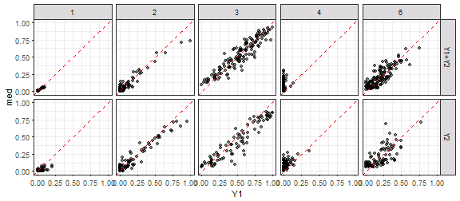

```r
ggplot(gg.EvgMed, aes(x=Y1, y=Y2)) + xlim(0,1) + ylim(0,1) + 
  geom_point(alpha=0.5) + facet_grid(Set~LC) + 
  geom_abline(slope=1, linetype=2, colour="red")
```

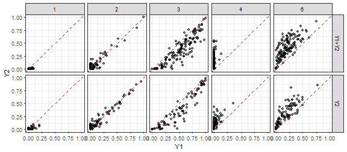

```r
ggplot(gg.EvgMed, aes(x=Y2, y=med)) + xlim(0,1) + ylim(0,1) + 
  geom_point(alpha=0.5) + facet_grid(Set~LC) + 
  geom_abline(slope=1, linetype=2, colour="red")
```

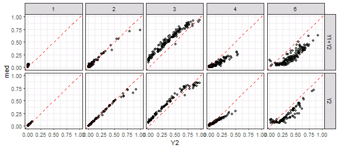

```r
ggplot(gg.med, aes(x=Y1, y=med, ymin=q25, ymax=q75)) + xlim(0,1) + ylim(0,1) + 
  geom_pointrange(alpha=0.5, colour="dodgerblue", fatten=1.5) + 
  geom_abline(slope=1, linetype=3) + facet_grid(Set~LC) 
```

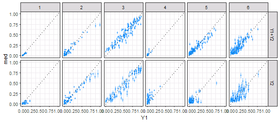

```r
ggplot(gg.EvgMed, aes(x=Y1, xend=Y1, y=Y2, yend=med,
                      colour=abs(Y2-Y1)<abs(med-Y1))) + 
  geom_abline(slope=1, linetype=3) + facet_grid(Set~LC) +
  scale_colour_manual(values=c("darkgreen", "red")) + xlim(0,1) + ylim(0,1) +
  geom_segment(arrow=arrow(length=unit(0.1, "cm")), alpha=0.4) + 
  labs(x="Y1", y="Y2 -> median") + theme(legend.position="none")
```

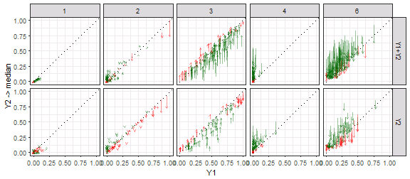

```r
##########
## RMSE
##########

gg.med %>% ungroup %>% group_by(Set, LC) %>%
  summarise(rmse.mod=(med-Y1)^2 %>% mean %>% sqrt %>% round(3))
```

```
## # A tibble: 12 x 3
## # Groups:   Set [?]
##      Set    LC rmse.mod
##    <chr> <int>    <dbl>
##  1 Y1+Y2     1    0.009
##  2 Y1+Y2     2    0.045
##  3 Y1+Y2     3    0.093
##  4 Y1+Y2     4    0.016
##  5 Y1+Y2     5    0.065
##  6 Y1+Y2     6    0.082
##  7    Y2     1    0.036
##  8    Y2     2    0.070
##  9    Y2     3    0.123
## 10    Y2     4    0.086
## 11    Y2     5    0.079
## 12    Y2     6    0.110
```

```r
gg.EvgMed %>% ungroup %>% group_by(Set, LC) %>%
  summarise(rmse.mod=(med-Y1)^2 %>% mean %>% sqrt %>% round(3),
            rmse.Y2=(Y2-Y1)^2 %>% mean %>% sqrt %>% round(3),
            diff=rmse.mod-rmse.Y2, prop=(diff/rmse.Y2) %>% round(3))
```

```
## # A tibble: 10 x 6
## # Groups:   Set [?]
##      Set    LC rmse.mod rmse.Y2   diff   prop
##    <chr> <dbl>    <dbl>   <dbl>  <dbl>  <dbl>
##  1 Y1+Y2     1    0.009   0.020 -0.011 -0.550
##  2 Y1+Y2     2    0.045   0.047 -0.002 -0.043
##  3 Y1+Y2     3    0.093   0.195 -0.102 -0.523
##  4 Y1+Y2     4    0.090   0.175 -0.085 -0.486
##  5 Y1+Y2     6    0.082   0.246 -0.164 -0.667
##  6    Y2     1    0.036   0.036  0.000  0.000
##  7    Y2     2    0.070   0.058  0.012  0.207
##  8    Y2     3    0.123   0.164 -0.041 -0.250
##  9    Y2     4    0.075   0.123 -0.048 -0.390
## 10    Y2     6    0.110   0.160 -0.050 -0.312
```


```r
ggplot(gg.med, aes(x=BlockCol, y=BlockRow)) + 
  geom_tile(aes(fill=med-Y1, colour=Set)) + facet_grid(.~LC) +
  scale_fill_gradient2(limits=c(-1, 1)) + 
  scale_colour_manual(values=c("NA", "gray30")) +
  geom_point(data=coords_star, aes(x=b.cols, y=b.rows), shape=1)
```

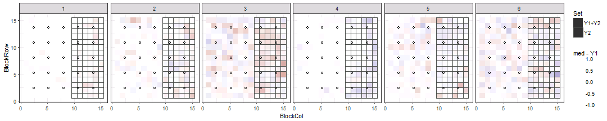


```r
gg.b <- ggs(out, "beta")
ggs_caterpillar(gg.b) + geom_vline(xintercept=0)
```

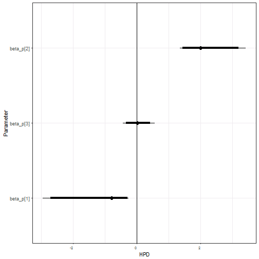

```r
traceplot(out, pars=c("beta_d", "beta_p"))
```

```
## Error in check_pars(allpars, pars): no parameter beta_d
```

```r
gg.b %>% group_by(Parameter) %>%
  summarise(q025=quantile(value, 0.025) %>% round(3), 
            q25=quantile(value, 0.25) %>% round(3),
            med=median(value) %>% round(3),
            q75=quantile(value, 0.75) %>% round(3), 
            q975=quantile(value, 0.975) %>% round(3))
```

```
## # A tibble: 3 x 6
##   Parameter   q025    q25    med    q75  q975
##      <fctr>  <dbl>  <dbl>  <dbl>  <dbl> <dbl>
## 1 beta_p[1] -1.042 -0.661 -0.464 -0.243 0.151
## 2 beta_p[2]  2.318  2.839  3.141  3.389 4.050
## 3 beta_p[3]  0.309  0.549  0.682  0.783 1.031
```


```r
stan_ess(out)
```

```
## `stat_bin()` using `bins = 30`. Pick better value with `binwidth`.
```

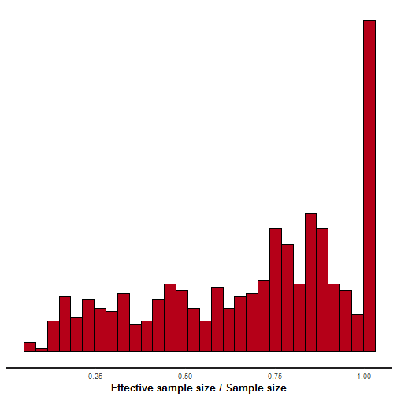

```r
stan_diag(out)
```

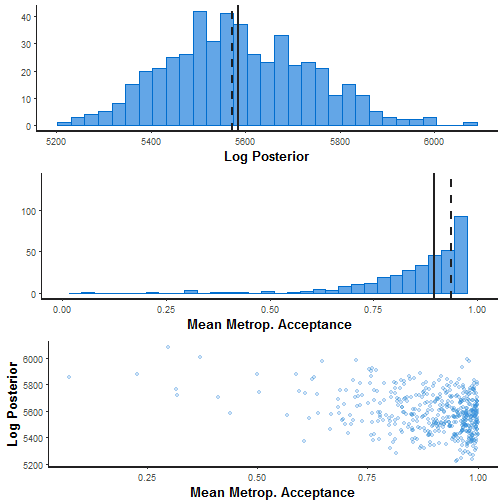

```r
stan_rhat(out)
```

```
## `stat_bin()` using `bins = 30`. Pick better value with `binwidth`.
```

```
## Warning: Removed 11 rows containing non-finite values (stat_bin).
```

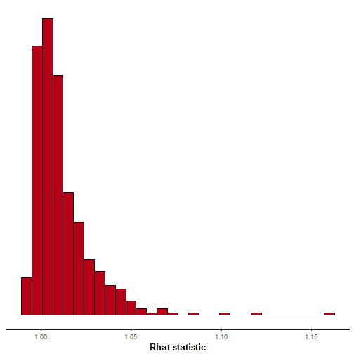

```r
ggs_crosscorrelation(gg.b)
```


```r
ggs_crosscorrelation(ggs(out, "theta"))
```

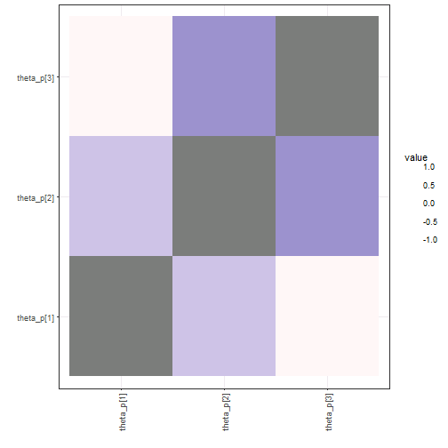

```r
sampler_params <- get_sampler_params(out, inc_warmup=FALSE) %>% do.call(rbind, .)
samp.out <- cbind(sampler_params[,c(1,6)], extract(out, pars="lp__")[[1]], 
                  extract(out, pars="L_sigma_unif")[[1]])
```

```
## Error in check_pars(allpars, pars): no parameter L_sigma_unif
```

```r
colnames(samp.out) <- c("accept_stat__", "energy__", "lp__", 
                        "L_sig1[1]", "L_sig1[2]", "L_sig1[3]", 
                        "L_sig1[4]", "L_sig1[5]")
```

```
## Error in colnames(samp.out) <- c("accept_stat__", "energy__", "lp__", : object 'samp.out' not found
```

```r
pairs(samp.out, diag.panel=panel.hist, lower.panel=panel.cor,
      upper.panel=function(...) smoothScatter(...,nrpoints=0, add=TRUE))
```

```
## Error in pairs(samp.out, diag.panel = panel.hist, lower.panel = panel.cor, : object 'samp.out' not found
```

```r
samp.out <- cbind(sampler_params[,c(1,6)], extract(out, pars="lp__")[[1]], 
                  extract(out, pars="beta_d")[[1]],
                  extract(out, pars="beta_p")[[1]])
```

```
## Error in check_pars(allpars, pars): no parameter beta_d
```

```r
pairs(samp.out, diag.panel=panel.hist, lower.panel=panel.cor,
      upper.panel=function(...) smoothScatter(...,nrpoints=0, add=TRUE))
```

```
## Error in pairs(samp.out, diag.panel = panel.hist, lower.panel = panel.cor, : object 'samp.out' not found
```

```r
# shinystan::launch_shinystan(out)
```


