```r
grdSz <- "01_1a"
blockSize <- 10  # block = (blockSize x blockSize) grid cells

# cell-block reference tibble
cb.i <- read_csv(paste0("data/roads_", grdSz, ".csv")) %>% 
  mutate(CellRow=1:n_distinct(top) %>% rep(n_distinct(left)),
         CellCol=1:n_distinct(left) %>% rep(each=n_distinct(top))) %>%
  filter((CellRow <= max((CellRow %/% blockSize) * blockSize)) &
           (CellCol <= max((CellCol %/% blockSize) * blockSize))) %>%
  mutate(BlockRow=((CellRow-1)%/%blockSize)+1, 
         BlockCol=((CellCol-1)%/%blockSize)+1,
         BlockID=paste(BlockCol, BlockRow) %>% factor %>% as.numeric) %>%
  select(c(CellID, CellRow, CellCol, BlockID, BlockRow, BlockCol, left, top))

# covariates summarized to blocks
pop00 <- read_csv(paste0("data/pop00_", grdSz, ".csv")) %>% 
  rename(CellID=category) %>% 
  add_blocks(cb.i=cb.i) %>% summarise(popTot=log(sum(sum)+0.001))
hous00 <- read_csv(paste0("data/housing00_", grdSz, ".csv")) %>% 
  rename(CellID=category) %>% 
  add_blocks(cb.i=cb.i) %>% summarise(secHome=log(sum(sum)+0.001))
rdLen <- read_csv(paste0("data/roads_", grdSz, ".csv")) %>% 
  add_blocks(cb.i=cb.i) %>% summarise(rdLen=log(sum(roadLen)+0.001)) 
clim <- read_csv(paste0("data/clim_", grdSz, ".csv")) %>% 
  add_blocks(cb.i=cb.i) %>% 
  summarise(b1=mean(bio1_mean), b7=mean(bio7_mean), b12=mean(bio12_mean))
topo <- read_csv(paste0("data/topo_", grdSz, ".csv")) %>% 
  add_blocks(cb.i=cb.i) %>% 
  summarise(el=mean(el_mean), rugg=mean(rugg_mean))
pWP <- read_csv(paste0("data/pWP_", grdSz, ".csv")) %>% 
  rename(CellID=category) %>%
  add_blocks(cb.i=cb.i) %>% summarise(mnWP=mean(mean)/100)

# land cover summarized to blocks
grnt <- read_csv(paste0("data/out_", grdSz, "_grnt.csv")) %>% 
  mutate(CellID=1:nrow(.)) %>% add_blocks(cb.i=cb.i) %>% 
  summarise(Dev=sum(V1)/n(), Oth=sum(V2)/n(), Hwd=sum(V3)/n(), 
            WP=sum(V4)/n(), Evg=sum(V5)/n(), Mxd=sum(V6)/n()) %>%
  select(-BlockID) %>% as.matrix
nlcd <- read_csv(paste0("data/out_",grdSz,"_nlcd.csv"))  %>% 
  mutate(CellID=1:nrow(.)) %>% add_blocks(cb.i=cb.i) %>% 
  summarise(Dev=sum(V1)/n(), Oth=sum(V2)/n(), Hwd=sum(V3)/n(), 
            Evg=sum(V4)/n(), Mxd=sum(V5)/n()) %>%
  select(-BlockID) %>% as.matrix
```


```r
# small scale runs: set nCell for Y1&Y2 and Y2
set.seed(2222)
nFit <- 1296
nNew <- 864
n <- sampleCells(nFit, nNew, nrow(grnt))

# Y1 & Y2
Y1.fit <- grnt[n$fit,]
Y1.new <- grnt[n$new,]
Y2 <- nlcd[n$all,]

# covariates: bias (Dev, Oth, Hwd, Evg, Mxd)
Xd <- vector("list", 4)
Xd[[1]] <- cbind(scale(rdLen$rdLen[n$all]), 
                 scale(pop00$popTot[n$all]),
                 scale(topo$el[n$all]))
Xd[[2]] <- cbind(scale(rdLen$rdLen[n$all]), 
                 scale(pop00$popTot[n$all]),
                 scale(clim$b7[n$all]))
Xd[[3]] <- cbind(scale(clim$b7[n$all]), 
                 scale(pop00$popTot[n$all]), 
                 scale(topo$el[n$all]))
Xd[[4]] <- cbind(scale(clim$b1[n$all]), 
                 scale(clim$b12[n$all]),
                 scale(pop00$popTot[n$all]))
nBd <- map_int(Xd, ncol)  # nBeta for each covariate

# covariates: WP|Evg
Xp <- cbind(scale(pWP$mnWP[n$all]), 
            scale(clim$b1[n$all]),
            scale(pop00$popTot[n$all]),
            scale(topo$rugg[n$all]))
nBp <- ncol(Xp)

Yd <- tibble(d1=c(scale(grnt[,1]-nlcd[,1])),
             d2=c(scale(grnt[,2]-nlcd[,2])),
             d3=c(scale(grnt[,3]-nlcd[,3])),
             d4=c(scale((grnt[,4] + grnt[,5])-nlcd[,4])),
             nuWP=c(scale((grnt[,4]+0.0001)/(grnt[,4] + grnt[,5] + 0.0001))),
             valWP=c(scale(pWP$mnWP)),
             rdLen=c(scale(rdLen$rdLen)),
             pop00=c(scale(pop00$popTot)),
             hous00=c(scale(hous00$secHome)),
             tmean=c(scale(clim$b1)),
             tseas=c(scale(clim$b7)),
             precip=c(scale(clim$b12)),
             el=c(scale(topo$el)),
             rugg=c(scale(topo$rugg)))
cor(Yd)
```

```
##                 d1          d2          d3          d4       nuWP
## d1      1.00000000 -0.34530310 -0.01471492 -0.14985544  0.2977139
## d2     -0.34530310  1.00000000 -0.08128199 -0.07046684 -0.1890393
## d3     -0.01471492 -0.08128199  1.00000000 -0.17550384  0.0370520
## d4     -0.14985544 -0.07046684 -0.17550384  1.00000000 -0.2885706
## nuWP    0.29771391 -0.18903931  0.03705200 -0.28857062  1.0000000
## valWP   0.34835763 -0.13825085 -0.20775101 -0.35626959  0.4065613
## rdLen   0.38289220 -0.30141524  0.04436215 -0.16965356  0.2662134
## pop00   0.34755925 -0.22109538 -0.10878875 -0.25800476  0.3557891
## hous00  0.25818138 -0.11795079 -0.03037603 -0.23131767  0.2860324
## tmean   0.30084502 -0.14434024 -0.18460890 -0.43023525  0.3983451
## tseas   0.29557634 -0.15260228 -0.24597091 -0.34776872  0.3888374
## precip -0.18973183  0.08982826 -0.03715671  0.18094056 -0.2376626
## el     -0.32588973  0.13844418  0.19221758  0.42279310 -0.4048498
## rugg   -0.27148508  0.01904688  0.05710069  0.04706590 -0.2326647
##             valWP       rdLen      pop00      hous00      tmean      tseas
## d1      0.3483576  0.38289220  0.3475592  0.25818138  0.3008450  0.2955763
## d2     -0.1382508 -0.30141524 -0.2210954 -0.11795079 -0.1443402 -0.1526023
## d3     -0.2077510  0.04436215 -0.1087887 -0.03037603 -0.1846089 -0.2459709
## d4     -0.3562696 -0.16965356 -0.2580048 -0.23131767 -0.4302353 -0.3477687
## nuWP    0.4065613  0.26621340  0.3557891  0.28603244  0.3983451  0.3888374
## valWP   1.0000000  0.35422596  0.5044681  0.36769874  0.7720649  0.7247185
## rdLen   0.3542260  1.00000000  0.4267143  0.34969365  0.3309080  0.2435511
## pop00   0.5044681  0.42671430  1.0000000  0.68057976  0.5123272  0.4638886
## hous00  0.3676987  0.34969365  0.6805798  1.00000000  0.3920572  0.3144292
## tmean   0.7720649  0.33090799  0.5123272  0.39205721  1.0000000  0.8182881
## tseas   0.7247185  0.24355107  0.4638886  0.31442916  0.8182881  1.0000000
## precip -0.3280285 -0.22084551 -0.2892328 -0.24120929 -0.5535844 -0.5138271
## el     -0.8048935 -0.35081805 -0.5156990 -0.37962666 -0.9726024 -0.8688409
## rugg   -0.4536198 -0.40489307 -0.2852943 -0.23853279 -0.3836317 -0.2369464
##             precip         el        rugg
## d1     -0.18973183 -0.3258897 -0.27148508
## d2      0.08982826  0.1384442  0.01904688
## d3     -0.03715671  0.1922176  0.05710069
## d4      0.18094056  0.4227931  0.04706590
## nuWP   -0.23766257 -0.4048498 -0.23266474
## valWP  -0.32802852 -0.8048935 -0.45361978
## rdLen  -0.22084551 -0.3508181 -0.40489307
## pop00  -0.28923279 -0.5156990 -0.28529428
## hous00 -0.24120929 -0.3796267 -0.23853279
## tmean  -0.55358444 -0.9726024 -0.38363170
## tseas  -0.51382711 -0.8688409 -0.23694636
## precip  1.00000000  0.4942576  0.33496308
## el      0.49425762  1.0000000  0.40490963
## rugg    0.33496308  0.4049096  1.00000000
```


```r
b.rows <- cb.i$BlockRow[match(rdLen$BlockID[n$all], cb.i$BlockID)]
b.cols <- cb.i$BlockCol[match(rdLen$BlockID[n$all], cb.i$BlockID)]
W <- as.matrix(dist(data.frame(b.rows, b.cols), diag=T, upper=T)) < 1.5
diag(W) <- 0
```


```r
d <- list(n1=nFit, n2=nFit+1, n3=n$tot, L=6, nB_d=nBd, nB_p=nBp,
          Y1=Y1.fit[,-6], Y2=Y2[,-5], W=W, W_n=sum(W)/2,
          X_d1=Xd[[1]], X_d2=Xd[[2]], X_d3=Xd[[3]], X_d4=Xd[[4]], X_p=Xp)
stan_rdump(ls(d), file="code/LC_mod_examp.Rdump", envir=list2env(d))
out <- stan(file="code/LC_mod_Y2X_phi.stan", init=0, thin=50,
            data=read_rdump("code/LC_mod_examp.Rdump"), 
            iter=50000, warmup=25000, chains=8, seed=4337, refresh=1000,
            include=FALSE, pars=c("nu", "Y2_new", "Y2_ds", "nu_all", "phi"))
```

```
## Loading required namespace: rstudioapi
```

```
## Warning: There were 3 divergent transitions after warmup. Increasing adapt_delta above 0.8 may help. See
## http://mc-stan.org/misc/warnings.html#divergent-transitions-after-warmup
```

```
## Warning: There were 27 transitions after warmup that exceeded the maximum treedepth. Increase max_treedepth above 10. See
## http://mc-stan.org/misc/warnings.html#maximum-treedepth-exceeded
```

```
## Warning: There were 8 chains where the estimated Bayesian Fraction of Missing Information was low. See
## http://mc-stan.org/misc/warnings.html#bfmi-low
```

```
## Warning: Examine the pairs() plot to diagnose sampling problems
```

```r
check_treedepth(out); check_energy(out); check_div(out)
```

```
## [1] "27 of 4000 iterations saturated the maximum tree depth of 10 (0.675%)"
## [1] "Run again with max_depth set to a larger value to avoid saturation"
```

```
## [1] "3 of 4000 iterations ended with a divergence (0.075%)"
## [1] "Try running with larger adapt_delta to remove the divergences"
```

```r
sampler_params <- get_sampler_params(out, inc_warmup=FALSE)
n_gradients <- sapply(sampler_params, function(x) sum(x[,'n_leapfrog__']))
n_gradients; sum(n_gradients)
```

```
## [1]  63500  63378 109019  35852  63500  63500  63500  63500
```

```
## [1] 525749
```


```r
##########
## munging
##########

# Full posterior
gg.nu <- ggs(out, "n_eta") %>% arrange(Parameter, Chain, Iteration)
nGG <- attr(gg.nu, "nChains")*attr(gg.nu, "nIterations")
gg.nu %<>% mutate(Y1=t(rbind(Y1.fit, Y1.new)) %>% c %>% rep(each=nGG),
                  LC=1:6 %>% rep(each=nGG) %>% rep(times=n$tot),
                  BlockID=n$all %>% rep(each=nGG*6),
                  CellID=1:length(n$all) %>% rep(each=nGG*6),
                  Set=c("Y1+Y2", "Y2") %>% rep(times=c(nFit, nNew)*nGG*6)) %>%
  mutate(BlockRow=cb.i$BlockRow[match(.$BlockID, cb.i$BlockID)], 
         BlockCol=cb.i$BlockCol[match(.$BlockID, cb.i$BlockID)])

# Medians
gg.med <- gg.nu %>% 
  group_by(CellID, BlockID, BlockRow, BlockCol, LC, Set, Parameter) %>%
  summarise(Y1=first(Y1), med=median(value), 
            q05=quantile(value, 0.05), q25=quantile(value, 0.25),
            q75=quantile(value, 0.75), q95=quantile(value, 0.95)) %>%
  ungroup() %>% group_by(BlockID)

# Combine WP + Evg to compare to Y2
gg.EvgComb <- gg.nu
gg.EvgComb$LC[gg.EvgComb$LC==5] <- 4
gg.EvgMed <- gg.EvgComb %>% group_by(CellID, BlockID, LC, Set) %>%
  summarise(med=median(value), Y1=first(Y1), 
            q05=quantile(value, 0.05), q25=quantile(value, 0.25),
            q75=quantile(value, 0.75), q95=quantile(value, 0.95)) %>%
  arrange(CellID, LC) %>%
  ungroup %>% mutate(Y2=t(Y2) %>% c)


##########
## plots
##########

ggplot(gg.EvgMed, aes(x=Y1, y=med)) + xlim(0,1) + ylim(0,1) + 
  geom_point(alpha=0.5) + facet_grid(Set~LC) + 
  geom_abline(slope=1, linetype=2, colour="red") + ggtitle("Y2_X")
```

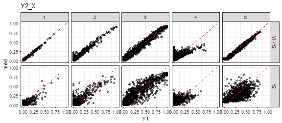

```r
ggplot(gg.EvgMed, aes(x=Y1, y=Y2)) + xlim(0,1) + ylim(0,1) + 
  geom_point(alpha=0.5) + facet_grid(Set~LC) + 
  geom_abline(slope=1, linetype=2, colour="red") + ggtitle("Y2_X") 
```

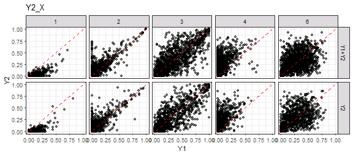

```r
ggplot(gg.EvgMed, aes(x=Y2, y=med)) + xlim(0,1) + ylim(0,1) + 
  geom_point(alpha=0.5) + facet_grid(Set~LC) + 
  geom_abline(slope=1, linetype=2, colour="red")  + ggtitle("Y2_X")
```

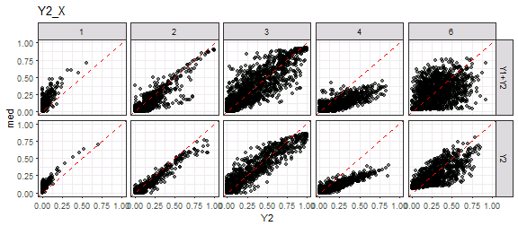

```r
ggplot(gg.med, aes(x=Y1, y=med, ymin=q25, ymax=q75)) + xlim(0,1) + ylim(0,1) + 
  geom_pointrange(alpha=0.5, colour="dodgerblue", fatten=1.5) + 
  geom_abline(slope=1, linetype=3) + facet_grid(Set~LC)  + ggtitle("Y2_X")
```


```r
ggplot(gg.EvgMed, aes(x=Y1, xend=Y1, y=Y2, yend=med,
                      colour=abs(Y2-Y1)<abs(med-Y1))) + 
  geom_abline(slope=1, linetype=3) + facet_grid(Set~LC) +
  scale_colour_manual(values=c("darkgreen", "red")) + xlim(0,1) + ylim(0,1) +
  geom_segment(arrow=arrow(length=unit(0.1, "cm")), alpha=0.4) + 
  labs(x="Y1", y="Y2 -> median") + theme(legend.position="none") +
  ggtitle("Y2_X")
```

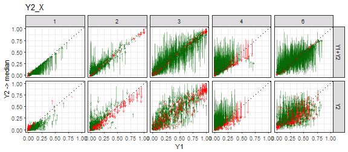

```r
ggplot(gg.med, aes(x=BlockCol, y=BlockRow, fill=med-Y1)) + 
  geom_tile() + facet_grid(Set~LC) +
  scale_fill_gradient2() + ggtitle("Y2_X")
```

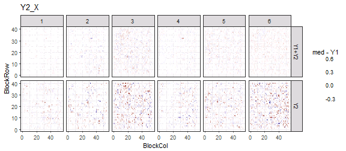

```r
##########
## RMSE
##########

gg.med %>% ungroup %>% group_by(Set, LC) %>%
  summarise(rmse.mod=(med-Y1)^2 %>% mean %>% sqrt %>% round(3))
```

```
## # A tibble: 12 x 3
## # Groups:   Set [?]
##      Set    LC rmse.mod
##    <chr> <int>    <dbl>
##  1 Y1+Y2     1    0.010
##  2 Y1+Y2     2    0.031
##  3 Y1+Y2     3    0.051
##  4 Y1+Y2     4    0.022
##  5 Y1+Y2     5    0.036
##  6 Y1+Y2     6    0.033
##  7    Y2     1    0.051
##  8    Y2     2    0.082
##  9    Y2     3    0.141
## 10    Y2     4    0.069
## 11    Y2     5    0.087
## 12    Y2     6    0.151
```

```r
gg.EvgMed %>% ungroup %>% group_by(Set, LC) %>%
  summarise(rmse.mod=(med-Y1)^2 %>% mean %>% sqrt %>% round(3),
            rmse.Y2=(Y2-Y1)^2 %>% mean %>% sqrt %>% round(3),
            diff=rmse.mod-rmse.Y2, prop=(diff/rmse.Y2) %>% round(3))
```

```
## # A tibble: 10 x 6
## # Groups:   Set [?]
##      Set    LC rmse.mod rmse.Y2   diff   prop
##    <chr> <dbl>    <dbl>   <dbl>  <dbl>  <dbl>
##  1 Y1+Y2     1    0.010   0.073 -0.063 -0.863
##  2 Y1+Y2     2    0.031   0.104 -0.073 -0.702
##  3 Y1+Y2     3    0.051   0.186 -0.135 -0.726
##  4 Y1+Y2     4    0.095   0.203 -0.108 -0.532
##  5 Y1+Y2     6    0.033   0.210 -0.177 -0.843
##  6    Y2     1    0.051   0.073 -0.022 -0.301
##  7    Y2     2    0.082   0.106 -0.024 -0.226
##  8    Y2     3    0.141   0.186 -0.045 -0.242
##  9    Y2     4    0.097   0.197 -0.100 -0.508
## 10    Y2     6    0.151   0.214 -0.063 -0.294
```


```r
gg.b <- ggs(out, "beta")
ggs_caterpillar(gg.b) + geom_vline(xintercept=0)
```

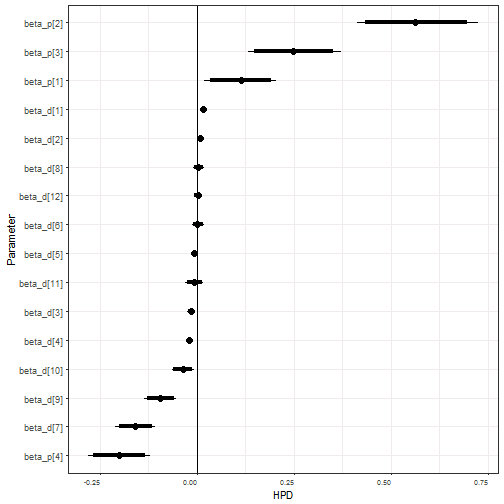

```r
traceplot(out, pars=c("beta_d", "beta_p"))
```

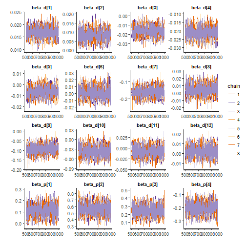

```r
gg.b %>% group_by(Parameter) %>%
  summarise(q025=quantile(value, 0.025) %>% round(3), 
            q25=quantile(value, 0.25) %>% round(3),
            med=median(value) %>% round(3),
            q75=quantile(value, 0.75) %>% round(3), 
            q975=quantile(value, 0.975) %>% round(3))
```

```
## # A tibble: 16 x 6
##     Parameter   q025    q25    med    q75   q975
##        <fctr>  <dbl>  <dbl>  <dbl>  <dbl>  <dbl>
##  1  beta_d[1]  0.013  0.016  0.017  0.018  0.021
##  2  beta_d[2]  0.003  0.006  0.008  0.010  0.014
##  3  beta_d[3] -0.026 -0.019 -0.016 -0.013 -0.006
##  4  beta_d[4] -0.027 -0.023 -0.021 -0.019 -0.015
##  5  beta_d[5] -0.015 -0.009 -0.006 -0.003  0.002
##  6  beta_d[6] -0.013 -0.003  0.002  0.007  0.018
##  7  beta_d[7] -0.210 -0.176 -0.159 -0.142 -0.107
##  8  beta_d[8] -0.009  0.000  0.004  0.009  0.018
##  9  beta_d[9] -0.137 -0.109 -0.094 -0.079 -0.053
## 10 beta_d[10] -0.065 -0.047 -0.036 -0.026 -0.007
## 11 beta_d[11] -0.030 -0.016 -0.007  0.001  0.016
## 12 beta_d[12] -0.008 -0.001  0.002  0.006  0.012
## 13  beta_p[1]  0.019  0.082  0.113  0.146  0.204
## 14  beta_p[2]  0.412  0.510  0.564  0.620  0.727
## 15  beta_p[3]  0.132  0.207  0.249  0.291  0.372
## 16  beta_p[4] -0.281 -0.227 -0.200 -0.174 -0.122
```


```r
stan_ess(out)
```

```
## `stat_bin()` using `bins = 30`. Pick better value with `binwidth`.
```

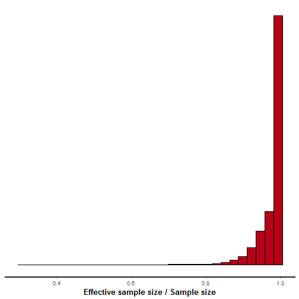

```r
stan_diag(out)
```


```r
stan_rhat(out)
```

```
## `stat_bin()` using `bins = 30`. Pick better value with `binwidth`.
```

```
## Warning: Removed 11 rows containing non-finite values (stat_bin).
```

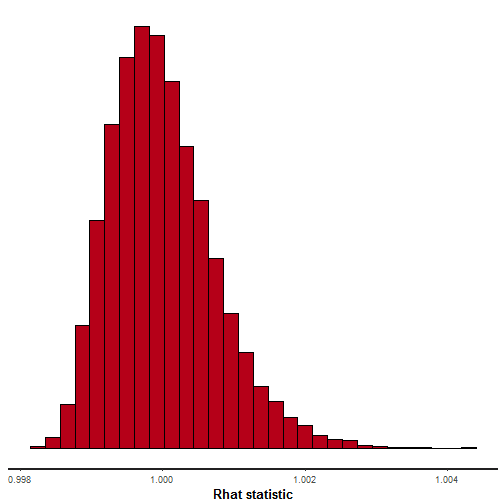

```r
ggs_crosscorrelation(gg.b)
```

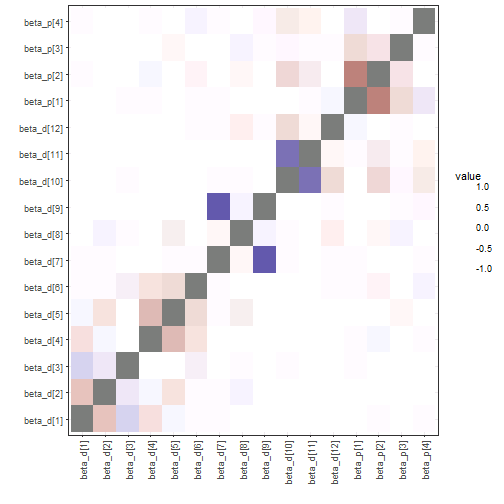

```r
ggs_crosscorrelation(ggs(out, "theta"))
```

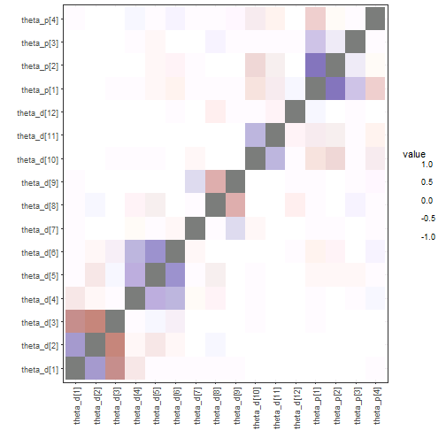

```r
sampler_params <- get_sampler_params(out, inc_warmup=FALSE) %>% do.call(rbind, .)
samp.out <- cbind(sampler_params[,c(1,6)], extract(out, pars="lp__")[[1]], 
                  extract(out, pars="L_sigma_unif")[[1]])
colnames(samp.out) <- c("accept_stat__", "energy__", "lp__", 
                        "L_sig1[1]", "L_sig1[2]", "L_sig1[3]", 
                        "L_sig1[4]", "L_sig1[5]")
pairs(samp.out, diag.panel=panel.hist, lower.panel=panel.cor,
      upper.panel=function(...) smoothScatter(...,nrpoints=0, add=TRUE))
```


```r
samp.out <- cbind(sampler_params[,c(1,6)], extract(out, pars="lp__")[[1]], 
                  extract(out, pars="beta_d")[[1]],
                  extract(out, pars="beta_p")[[1]])
pairs(samp.out, diag.panel=panel.hist, lower.panel=panel.cor,
      upper.panel=function(...) smoothScatter(...,nrpoints=0, add=TRUE))
```

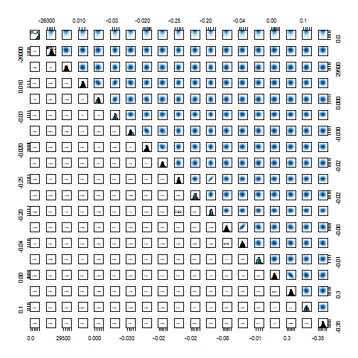

```r
#shinystan::launch_shinystan(out)
```


