```r
grdSz <- "01_1a"
blockSize <- 10  # block = (blockSize x blockSize) grid cells

# cell-block reference tibble
cb.i <- read_csv(paste0("data/roads_", grdSz, ".csv")) %>% 
  mutate(CellRow=1:n_distinct(top) %>% rep(n_distinct(left)),
         CellCol=1:n_distinct(left) %>% rep(each=n_distinct(top))) %>%
  filter((CellRow <= max((CellRow %/% blockSize) * blockSize)) &
           (CellCol <= max((CellCol %/% blockSize) * blockSize))) %>%
  mutate(BlockRow=((CellRow-1)%/%blockSize)+1, 
         BlockCol=((CellCol-1)%/%blockSize)+1,
         BlockID=paste(BlockCol, BlockRow) %>% factor %>% as.numeric) %>%
  select(c(CellID, CellRow, CellCol, BlockID, BlockRow, BlockCol, left, top))

# covariates summarized to blocks
pop00 <- read_csv(paste0("data/pop00_", grdSz, ".csv")) %>% 
  rename(CellID=category) %>% 
  add_blocks(cb.i=cb.i) %>% summarise(popTot=sum(sum)) 
hous00 <- read_csv(paste0("data/housing00_", grdSz, ".csv")) %>% 
  rename(CellID=category) %>% 
  add_blocks(cb.i=cb.i) %>% summarise(secHome=sum(sum)) 
rdLen <- read_csv(paste0("data/roads_", grdSz, ".csv")) %>% 
  add_blocks(cb.i=cb.i) %>% summarise(rdLen=sum(roadLen)) 
clim <- read_csv(paste0("data/clim_", grdSz, ".csv")) %>% 
  add_blocks(cb.i=cb.i) %>% 
  summarise(b1=mean(bio1_mean), b7=mean(bio7_mean), b12=mean(bio12_mean))
pWP <- read_csv(paste0("data/pWP_", grdSz, ".csv")) %>% 
  rename(CellID=category) %>%
  add_blocks(cb.i=cb.i) %>% summarise(mnWP=mean(mean)/100)

# land cover summarized to blocks
grnt <- read_csv(paste0("data/out_", grdSz, "_grnt.csv")) %>% 
  mutate(CellID=1:nrow(.)) %>% add_blocks(cb.i=cb.i) %>% 
  summarise(Dev=sum(V1)/n(), Oth=sum(V2)/n(), Hwd=sum(V3)/n(), 
            WP=sum(V4)/n(), Evg=sum(V5)/n(), Mxd=sum(V6)/n()) %>%
  select(-BlockID) %>% as.matrix
nlcd <- read_csv(paste0("data/out_",grdSz,"_nlcd.csv"))  %>% 
  mutate(CellID=1:nrow(.)) %>% add_blocks(cb.i=cb.i) %>% 
  summarise(Dev=sum(V1)/n(), Oth=sum(V2)/n(), Hwd=sum(V3)/n(), 
            Evg=sum(V4)/n(), Mxd=sum(V5)/n()) %>%
  select(-BlockID) %>% as.matrix
```


```r
# small scale runs: set nCell for Y1&Y2 and Y2
set.seed(2211)
nFit <- 1200
nNew <- 800
n <- sampleCells(nFit, nNew, nrow(grnt))

# Y1 & Y2
Y1.fit <- grnt[n$fit,]
Y1.new <- grnt[n$new,]
Y2 <- nlcd[n$all,]

# covariates: bias (Dev, Oth, Hwd, Evg, Mxd)
Xd <- vector("list", 4)
Xd[[1]] <- cbind(scale(rdLen$rdLen[n$all]), scale(hous00$secHome[n$all]))
Xd[[2]] <- cbind(scale(rdLen$rdLen[n$all]), scale(pop00$popTot[n$all]))
Xd[[3]] <- matrix(scale(clim$b7[n$all]), ncol=1)
Xd[[4]] <- cbind(scale(clim$b1[n$all]), scale(clim$b12[n$all]))
nBd <- map_int(Xd, ncol)  # nBeta for each covariate

# covariates: WP|Evg
Xp <- cbind(scale(pWP$mnWP[n$all]), scale(clim$b1[n$all]), scale(clim$b12[n$all]))
nBp <- ncol(Xp)
```


```r
d <- list(n1=nFit, n2=nFit+1, n3=n$tot, L=6, nB_d=nBd, nB_p=nBp,
          Y1=Y1.fit[,-6], Y2=Y2[,-5], 
          X_d1=Xd[[1]], X_d2=Xd[[2]], X_d3=Xd[[3]], X_d4=Xd[[4]], X_p=Xp)
out <- stan(file="code/LC_mod_qrBeta.stan", data=d, init=0, thin=75, 
            iter=50000, warmup=30000, chains=8, seed=43337, refresh=2000,
            include=FALSE, pars=c("Y2_ds", "nu"),
            control=list(max_treedepth=30, adapt_delta=0.95, metric="diag_e"))
```

```
## hash mismatch so recompiling; make sure Stan code ends with a blank line
```

```
## In file included from C:/Users/tms1044/Documents/R/win-library/3.4/BH/include/boost/config.hpp:39:0,
##                  from C:/Users/tms1044/Documents/R/win-library/3.4/BH/include/boost/math/tools/config.hpp:13,
##                  from C:/Users/tms1044/Documents/R/win-library/3.4/StanHeaders/include/stan/math/rev/core/var.hpp:7,
##                  from C:/Users/tms1044/Documents/R/win-library/3.4/StanHeaders/include/stan/math/rev/core/gevv_vvv_vari.hpp:5,
##                  from C:/Users/tms1044/Documents/R/win-library/3.4/StanHeaders/include/stan/math/rev/core.hpp:12,
##                  from C:/Users/tms1044/Documents/R/win-library/3.4/StanHeaders/include/stan/math/rev/mat.hpp:4,
##                  from C:/Users/tms1044/Documents/R/win-library/3.4/StanHeaders/include/stan/math.hpp:4,
##                  from C:/Users/tms1044/Documents/R/win-library/3.4/StanHeaders/include/src/stan/model/model_header.hpp:4,
##                  from file78cc76d54aa.cpp:8:
## C:/Users/tms1044/Documents/R/win-library/3.4/BH/include/boost/config/compiler/gcc.hpp:186:0: warning: "BOOST_NO_CXX11_RVALUE_REFERENCES" redefined
##  #  define BOOST_NO_CXX11_RVALUE_REFERENCES
##  ^
## <command-line>:0:0: note: this is the location of the previous definition
## cc1plus.exe: warning: unrecognized command line option "-Wno-ignored-attributes"
```

```
## Loading required namespace: rstudioapi
```

```
## Warning: There were 3 divergent transitions after warmup. Increasing adapt_delta above 0.95 may help. See
## http://mc-stan.org/misc/warnings.html#divergent-transitions-after-warmup
```

```
## Warning: There were 8 chains where the estimated Bayesian Fraction of Missing Information was low. See
## http://mc-stan.org/misc/warnings.html#bfmi-low
```

```
## Warning: Examine the pairs() plot to diagnose sampling problems
```

```r
check_treedepth(out); check_energy(out); check_div(out)
```

```
## [1] "543 of 2136 iterations saturated the maximum tree depth of 10 (25.4213483146067%)"
## [1] "Run again with max_depth set to a larger value to avoid saturation"
```

```
## [1] "Chain 1: E-BFMI = 0.158327190346007"
## [1] "E-BFMI below 0.2 indicates you may need to reparameterize your model"
## [1] "Chain 2: E-BFMI = 0.0924806300491886"
## [1] "E-BFMI below 0.2 indicates you may need to reparameterize your model"
## [1] "Chain 3: E-BFMI = 0.0573348378238287"
## [1] "E-BFMI below 0.2 indicates you may need to reparameterize your model"
## [1] "Chain 4: E-BFMI = 0.180738197744743"
## [1] "E-BFMI below 0.2 indicates you may need to reparameterize your model"
## [1] "Chain 5: E-BFMI = 0.0631659276062291"
## [1] "E-BFMI below 0.2 indicates you may need to reparameterize your model"
## [1] "Chain 6: E-BFMI = 0.0484299249000848"
## [1] "E-BFMI below 0.2 indicates you may need to reparameterize your model"
## [1] "Chain 7: E-BFMI = 0.161228243474045"
## [1] "E-BFMI below 0.2 indicates you may need to reparameterize your model"
## [1] "Chain 8: E-BFMI = 0.068932087482638"
## [1] "E-BFMI below 0.2 indicates you may need to reparameterize your model"
```

```
## [1] "3 of 2136 iterations ended with a divergence (0.140449438202247%)"
## [1] "Try running with larger adapt_delta to remove the divergences"
```

```r
sampler_params <- get_sampler_params(out, inc_warmup=FALSE)
n_gradients <- sapply(sampler_params, function(x) sum(x[,'n_leapfrog__']))
n_gradients; sum(n_gradients)
```

```
## [1] 193883 138260 195829 550645 273141 134645 210165 137973
```

```
## [1] 1834541
```


```r
##########
## munging
##########

# Full posterior
gg.nu <- ggs(out, "n_eta") %>% arrange(Parameter, Chain, Iteration)
nGG <- attr(gg.nu, "nChains")*attr(gg.nu, "nIterations")
gg.nu %<>% mutate(Y1=t(rbind(Y1.fit, Y1.new)) %>% c %>% rep(each=nGG),
                  LC=1:6 %>% rep(each=nGG) %>% rep(times=n$tot),
                  Cell=1:n$tot %>% rep(each=nGG*6),
                  Set=c("Y1+Y2", "Y2") %>% rep(times=c(nFit, nNew)*nGG*6))

# Medians
gg.med <- gg.nu %>% group_by(Cell, LC, Set, Parameter) %>%
  summarise(Y1=first(Y1), med=median(value), 
            q05=quantile(value, 0.05), q25=quantile(value, 0.25),
            q75=quantile(value, 0.75), q95=quantile(value, 0.95)) %>%
  ungroup() %>% group_by(Cell)

# Combine WP + Evg to compare to Y2
gg.EvgComb <- gg.nu
gg.EvgComb$LC[gg.EvgComb$LC==5] <- 4
gg.EvgMed <- gg.EvgComb %>% group_by(Cell, LC, Set) %>%
  summarise(med=median(value), Y1=first(Y1), 
            q05=quantile(value, 0.05), q25=quantile(value, 0.25),
            q75=quantile(value, 0.75), q95=quantile(value, 0.95)) %>%
  ungroup %>% mutate(Y2=t(Y2) %>% c)


##########
## plots
##########

ggplot(gg.EvgMed, aes(x=Y1, y=med)) + xlim(0,1) + ylim(0,1) + 
  geom_point() + geom_abline(slope=1, linetype=3) + facet_grid(Set~LC) 
```

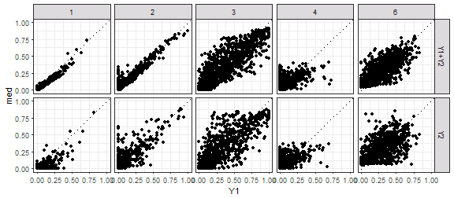

```r
ggplot(gg.EvgMed, aes(x=Y1, y=Y2)) + xlim(0,1) + ylim(0,1) + 
  geom_point() + geom_abline(slope=1, linetype=3) + facet_grid(Set~LC) 
```

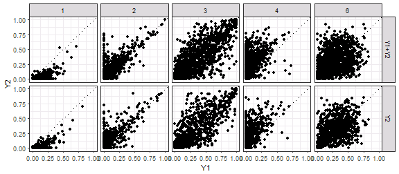

```r
ggplot(gg.EvgMed, aes(x=Y2, y=med)) + xlim(0,1) + ylim(0,1) + 
  geom_point() + geom_abline(slope=1, linetype=3) + facet_grid(Set~LC) 
```

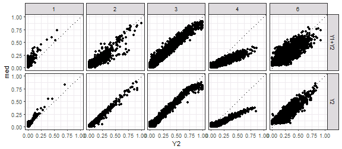

```r
ggplot(gg.med, aes(x=Y1, y=med, ymin=q25, ymax=q75)) + xlim(0,1) + ylim(0,1) + 
  geom_pointrange(alpha=0.5, colour="dodgerblue", fatten=1.5) + 
  geom_abline(slope=1, linetype=3) + facet_grid(Set~LC) 
```

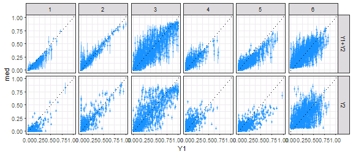

```r
ggplot(gg.EvgMed, aes(x=Y1, xend=Y1, y=Y2, yend=med,
                      colour=abs(Y2-Y1)<abs(med-Y1))) + 
  geom_abline(slope=1, linetype=3) + facet_grid(Set~LC) +
  scale_colour_manual(values=c("darkgreen", "red")) + xlim(0,1) + ylim(0,1) +
  geom_segment(arrow=arrow(length=unit(0.1, "cm")), alpha=0.4) + 
  labs(x="Y1", y="Y2 -> median") + theme(legend.position="none")
```

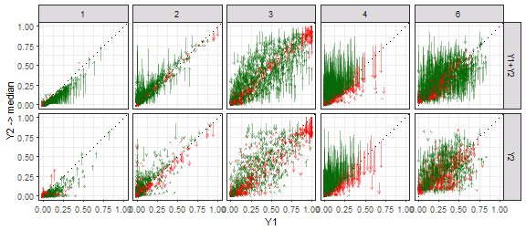

```r
##########
## RMSE
##########

gg.med %>% ungroup %>% group_by(Set, LC) %>%
  summarise(rmse.mod=(med-Y1)^2 %>% mean %>% sqrt %>% round(3))
```

```
## # A tibble: 12 x 3
## # Groups:   Set [?]
##      Set    LC rmse.mod
##    <chr> <int>    <dbl>
##  1 Y1+Y2     1    0.026
##  2 Y1+Y2     2    0.041
##  3 Y1+Y2     3    0.140
##  4 Y1+Y2     4    0.062
##  5 Y1+Y2     5    0.087
##  6 Y1+Y2     6    0.119
##  7    Y2     1    0.066
##  8    Y2     2    0.097
##  9    Y2     3    0.175
## 10    Y2     4    0.093
## 11    Y2     5    0.113
## 12    Y2     6    0.171
```

```r
gg.EvgMed %>% ungroup %>% group_by(Set, LC) %>%
  summarise(rmse.mod=(med-Y1)^2 %>% mean %>% sqrt %>% round(3),
            rmse.Y2=(Y2-Y1)^2 %>% mean %>% sqrt %>% round(3),
            diff=rmse.mod-rmse.Y2, prop=(diff/rmse.Y2) %>% round(3))
```

```
## # A tibble: 10 x 6
## # Groups:   Set [?]
##      Set    LC rmse.mod rmse.Y2   diff   prop
##    <chr> <dbl>    <dbl>   <dbl>  <dbl>  <dbl>
##  1 Y1+Y2     1    0.026   0.073 -0.047 -0.644
##  2 Y1+Y2     2    0.041   0.103 -0.062 -0.602
##  3 Y1+Y2     3    0.140   0.188 -0.048 -0.255
##  4 Y1+Y2     4    0.099   0.202 -0.103 -0.510
##  5 Y1+Y2     6    0.119   0.216 -0.097 -0.449
##  6    Y2     1    0.066   0.075 -0.009 -0.120
##  7    Y2     2    0.097   0.106 -0.009 -0.085
##  8    Y2     3    0.175   0.184 -0.009 -0.049
##  9    Y2     4    0.105   0.200 -0.095 -0.475
## 10    Y2     6    0.171   0.206 -0.035 -0.170
```


```r
gg.b <- ggs(out, "beta")
ggs_caterpillar(gg.b) + geom_vline(xintercept=0)
```

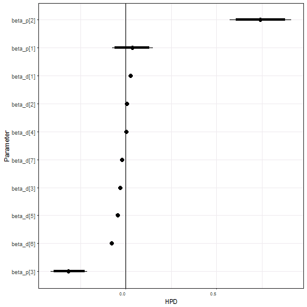

```r
ggs_traceplot(gg.b) + facet_wrap(~Parameter, scales="free")
```

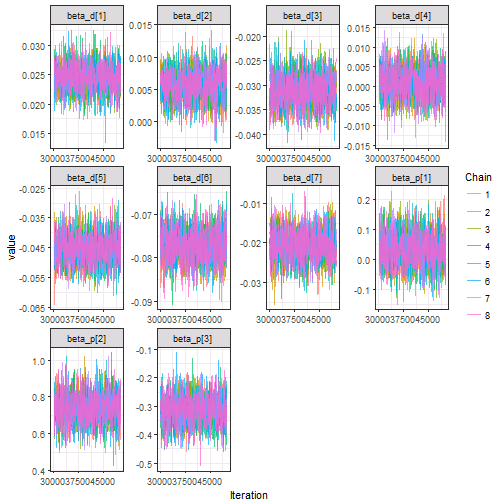

```r
gg.b %>% group_by(Parameter) %>%
  summarise(q025=quantile(value, 0.025) %>% round(3), 
            q25=quantile(value, 0.25) %>% round(3),
            med=median(value) %>% round(3),
            q75=quantile(value, 0.75) %>% round(3), 
            q975=quantile(value, 0.975) %>% round(3))
```

```
## # A tibble: 10 x 6
##    Parameter   q025    q25    med    q75   q975
##       <fctr>  <dbl>  <dbl>  <dbl>  <dbl>  <dbl>
##  1 beta_d[1]  0.020  0.023  0.025  0.026  0.029
##  2 beta_d[2]  0.001  0.004  0.006  0.007  0.010
##  3 beta_d[3] -0.038 -0.033 -0.031 -0.029 -0.024
##  4 beta_d[4] -0.007 -0.002  0.001  0.004  0.009
##  5 beta_d[5] -0.055 -0.049 -0.045 -0.042 -0.035
##  6 beta_d[6] -0.085 -0.080 -0.077 -0.075 -0.070
##  7 beta_d[7] -0.028 -0.023 -0.021 -0.018 -0.013
##  8 beta_p[1] -0.076 -0.007  0.034  0.074  0.150
##  9 beta_p[2]  0.572  0.685  0.740  0.794  0.913
## 10 beta_p[3] -0.414 -0.351 -0.316 -0.277 -0.212
```


```r
stan_ess(out)
```

```
## `stat_bin()` using `bins = 30`. Pick better value with `binwidth`.
```

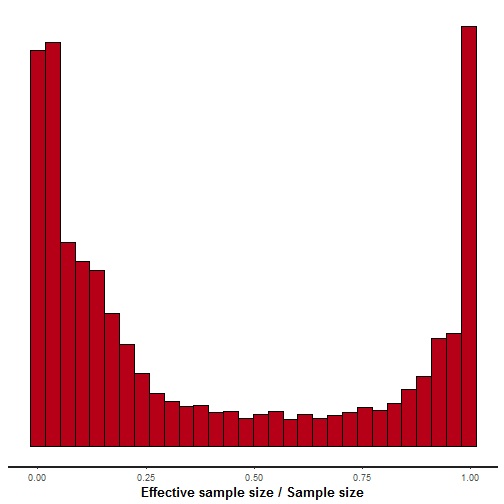

```r
stan_diag(out)
```

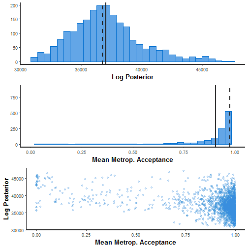

```r
stan_rhat(out)
```

```
## `stat_bin()` using `bins = 30`. Pick better value with `binwidth`.
```

```
## Warning: Removed 22 rows containing non-finite values (stat_bin).
```

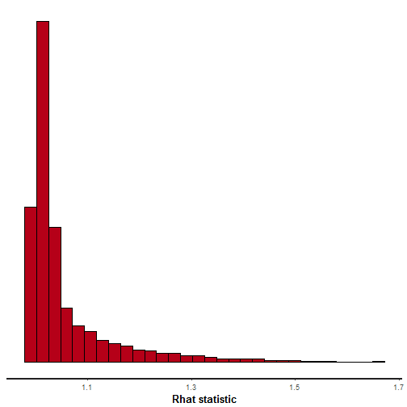

```r
ggs_crosscorrelation(gg.b)
```

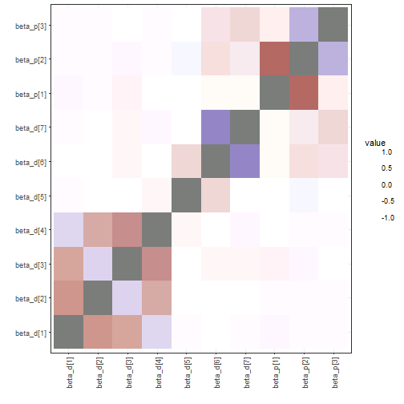

```r
sampler_params <- get_sampler_params(out, inc_warmup=FALSE) %>% do.call(rbind, .)
samp.out <- cbind(sampler_params[,c(1,6)], extract(out, pars="lp__")[[1]], 
                  extract(out, pars="L_sigma_unif_Y1")[[1]],
                  extract(out, pars="L_sigma_unif_Y2")[[1]])
```

```
## Error in check_pars(allpars, pars): no parameter L_sigma_unif_Y1
```

```r
colnames(samp.out) <- c("accept_stat__", "energy__", "lp__", 
                        "L_sig1[1]", "L_sig1[2]", "L_sig1[3]", 
                        "L_sig1[4]", "L_sig1[5]", 
                        "L_sig2[1]", "L_sig2[2]", "L_sig2[3]", "L_sig2[4]")
```

```
## Error in colnames(samp.out) <- c("accept_stat__", "energy__", "lp__", : object 'samp.out' not found
```

```r
pairs(samp.out, diag.panel=panel.hist, lower.panel=panel.cor,
      upper.panel=function(...) smoothScatter(...,nrpoints=0, add=TRUE))
```

```
## Error in pairs(samp.out, diag.panel = panel.hist, lower.panel = panel.cor, : object 'samp.out' not found
```

```r
samp.out <- cbind(sampler_params[,c(1,6)], extract(out, pars="lp__")[[1]], 
                  extract(out, pars="beta_d")[[1]],
                  extract(out, pars="beta_p")[[1]])
pairs(samp.out, diag.panel=panel.hist, lower.panel=panel.cor,
      upper.panel=function(...) smoothScatter(...,nrpoints=0, add=TRUE))
```

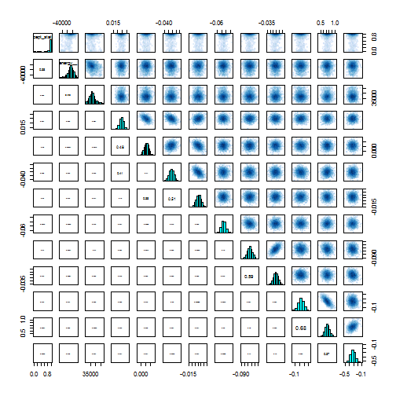

```r
shinystan::launch_shinystan(out)
```

```
## 
## Creating shinystan object...
```

```
## 
## Launching ShinyStan interface... for large models this  may take some time.
```

```
## Loading required package: shiny
```

```
## 
## Listening on http://127.0.0.1:7620
```


